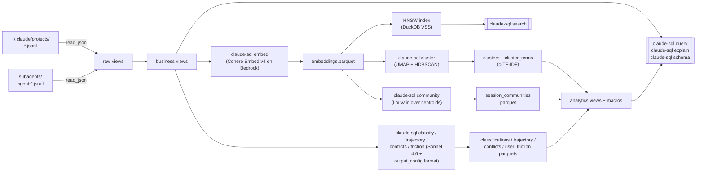

# claude-sql

> **Ask your Claude Code transcripts anything.**
> Your sessions are already on disk. `claude-sql` turns them into a
> searchable, explorable, self-improving record of your work — in place,
> with zero copy.

## What you get out of it

**Remember what you worked on.**

- "What was that thing I did last Tuesday with DuckDB and HNSW?"
- "Show me every conversation I've had about temporal workflows, ranked by
  relevance."
- "Which week did I finally figure out that memory bug?"

**See where your time and money actually go.**

- "Which sessions cost me more than $5 on Opus this month — and what was I
  trying to do?"
- "Which tools am I leaning on most? Which ones fail the most?"
- "Where am I spending hours on prose vs. on tool calls?"

**Notice patterns in how you work.**

- "When do I hand-hold the agent step-by-step vs. let it run on its own?
  Has that shifted over time?"
- "What kinds of work am I doing most — coding, strategy, admin, writing?"
- "Which session types actually finish successfully vs. trail off?"
- "Which todos do I create and never close out?"

**Surface themes across hundreds of conversations.**

- "Group my sessions by what they're *about* and tell me what moved this
  month."
- "Show me the biggest themes in my work and what's trending."
- "When I've wrestled with the same problem across multiple sessions,
  group them together so I can see the arc."

**Catch yourself disagreeing with yourself.**

- "Find sessions where I took two opposing positions on the same decision
  — and flag which ones got resolved vs. abandoned."

**Spot where the agent left you hanging.**

- "Which sessions had me pinging for status the most? What was the agent
  doing?"
- "Show me every time I asked a one-word question like *screenshot?*
  because the agent didn't proactively share one."
- "Rank sessions by how often I had to interrupt or correct the agent."

`claude-sql` turns every one of those into a SQL query that runs in under
a second on the live JSONL corpus — no export, no pipeline.

## How it works



Every parquet is cached and rebuilt only on explicit re-run. Views
register over whichever parquets exist at connection open — missing ones
warn and no-op, never crash.

## Install

### As a uv tool (recommended)

`claude-sql` is **not published to PyPI**. Install it from a local
checkout. `mise run tool:install` wraps `uv tool install --from .
claude-sql --force --reinstall` so the binary on your `PATH` lands in an
isolated uv-managed venv.

```bash
git clone https://github.com/theagenticguy/claude-sql.git
cd claude-sql
mise run tool:install     # → uv tool install --from . claude-sql --force --reinstall
claude-sql --version
```

Upgrade after pulling new commits by re-running the same task (the
`tool:upgrade` alias runs an identical command with clearer intent):

```bash
git pull
mise run tool:upgrade
```

> **Note.** `uv tool upgrade claude-sql` does **not** work — it resolves
> against PyPI, which has no `claude-sql` package. Always reinstall from
> your checkout.

Remove it with:

```bash
mise run tool:uninstall   # → uv tool uninstall claude-sql
```

### Project install (for development)

```bash
git clone https://github.com/theagenticguy/claude-sql.git
cd claude-sql
mise install              # fetch pinned Python + uv
mise run install          # uv sync --all-extras + install lefthook git hooks
mise run check            # ruff + fmt + ty + pytest
```

`mise` auto-activates `.venv` on `cd`. Every command below is also
available as a mise task — run `mise tasks` for the full list.

`mise run install` also installs the lefthook git hooks. Re-run
`mise run hooks:install` any time `lefthook.yml` changes.

### AWS credentials

Semantic search and Sonnet classification require Bedrock access.

```bash
export AWS_PROFILE=your-profile
```

The IAM policy needs `bedrock:InvokeModel` on:

- `inference-profile/global.cohere.embed-v4:0`
- `inference-profile/global.anthropic.claude-sonnet-4-6`

## Quick tour

```bash
# Inspect every registered view + macro.
claude-sql schema

# Opus sessions over $5 in the last 30 days.
claude-sql query "
  SELECT session_id, model_used(session_id) AS model,
         cost_estimate(session_id) AS usd
  FROM sessions
  WHERE started_at >= current_timestamp - INTERVAL 30 DAY
    AND model_used(session_id) LIKE '%opus%'
    AND cost_estimate(session_id) > 5.0
  ORDER BY usd DESC
"

# See the EXPLAIN plan (static by default — no execution).
claude-sql explain "SELECT * FROM messages WHERE session_id = '<uuid>' LIMIT 1"

# Drop into the DuckDB REPL with everything pre-registered.
claude-sql shell

# Backfill embeddings (Cohere Embed v4 via global CRIS).
claude-sql embed --since-days 30

# Semantic search.
claude-sql search "temporal workflow determinism" --k 10

# Classify every recent session (dry-run prints a cost estimate first).
claude-sql classify --dry-run --since-days 30
claude-sql classify --no-dry-run --since-days 30

# Friction classifier — status pings, unmet expectations, interruptions.
claude-sql friction --dry-run --since-days 14
claude-sql friction --no-dry-run --since-days 14
claude-sql query "SELECT * FROM friction_counts(14)"
claude-sql query "SELECT * FROM friction_examples('unmet_expectation', 10)"

# Seed the Skills catalog from ~/.claude/skills + ~/.claude/plugins/cache.
claude-sql skills sync
claude-sql skills ls --kind plugin-skill | head
claude-sql query "SELECT * FROM skill_rank(30) LIMIT 15"
claude-sql query "SELECT * FROM skill_source_mix(30) WHERE skill_id LIKE '%erpaval%'"
claude-sql query "SELECT * FROM unused_skills(30) LIMIT 20"

# Full analytics pipeline (includes a zero-cost `skills sync` at step 0).
claude-sql analyze --since-days 30 --no-dry-run
```

More recipes in [`docs/cookbook.md`](docs/cookbook.md) (v1: sessions,
messages, tools, todos, subagents, semantic search) and
[`docs/analytics_cookbook.md`](docs/analytics_cookbook.md) (v2: clusters,
communities, classifications, trajectory, conflicts, friction).

## CLI surface

Every subcommand shares the top-level flags: `--verbose` / `--quiet`,
`--glob`, `--subagent-glob`, and `--format {auto,table,json,ndjson,csv}`.
Commands that spend real Bedrock money default to `--dry-run`.

| Command | Purpose |
|---|---|
| `schema` | List every view + its columns, plus every macro |
| `query <sql>` | Run a query, emit as table / JSON / NDJSON / CSV |
| `explain <sql>` | Static `EXPLAIN` by default; `--analyze` for `EXPLAIN ANALYZE` |
| `shell` | Launch the `duckdb` REPL with everything pre-registered |
| `list-cache` | Report freshness + row counts for every parquet cache |
| `embed` | Backfill embeddings via Cohere Embed v4 on Bedrock |
| `search <text>` | HNSW cosine semantic search over embeddings |
| `classify` | Sonnet 4.6 → session autonomy + work category + success + goal |
| `trajectory` | Per-message sentiment + `is_transition` |
| `conflicts` | Per-session stance-conflict detection |
| `friction` | Regex + Sonnet 4.6 → status pings, unmet expectations, confusion, etc. |
| `cluster` | UMAP → HDBSCAN → c-TF-IDF over message embeddings |
| `community` | Louvain over session centroids |
| `skills sync` | Walk `~/.claude/skills/` + `~/.claude/plugins/cache/` → seedable skills catalog |
| `skills ls` | List catalog entries, filterable by `--kind` and `--plugin` |
| `analyze` | Run the whole pipeline in dependency order |

### Agent-friendly defaults

- **`--format auto`** emits a human table on a TTY and JSON when stdout
  is piped, so agents calling `claude-sql` via subprocess get JSON for
  free. `json`, `ndjson`, and `csv` are always available explicitly.
- **Classified exit codes** for DuckDB errors — `64` for parse errors,
  `65` for unknown view / column / macro, `70` for other runtime
  errors, and `2` when `search` is called before `embed` has run. On
  non-TTY stdout the error also comes back as
  `{"error": {"kind", "message", "hint"}}` on stderr, so agents don't
  have to scrape tracebacks.
- **`list-cache`** reports every parquet (embeddings, classifications,
  trajectory, conflicts, clusters, cluster terms, communities,
  friction) with its `{exists, bytes, mtime, rows}`, so an agent can
  decide whether to run a prerequisite stage before issuing a `search`
  or `query`.
- **`explain`** is a static plan by default (no query execution); pass
  `--analyze` for `EXPLAIN ANALYZE` when you want real timings.
- **`--quiet`** drops INFO / WARNING logs to ERROR-only. View
  registration happens at DEBUG level, so the default `query` stderr is
  already empty unless something actually warrants attention.

## Views

| View | Grain | Key columns |
|---|---|---|
| `sessions` | one per transcript file | `session_id`, `started_at`, `ended_at` |
| `messages` | one per chat message | `uuid`, `session_id`, `role`, `model`, token usage |
| `content_blocks` | flattened `message.content[]` | `block_type`, `tool_name` |
| `messages_text` | text blocks aggregated per message | `uuid`, `text_content` |
| `tool_calls` | `content_blocks` where `type='tool_use'` | `tool_name`, `tool_use_id` |
| `tool_results` | `content_blocks` where `type='tool_result'` | `tool_use_id`, `content` |
| `todo_events` | one row per todo per `TodoWrite` snapshot | `subject`, `status`, `snapshot_ix` |
| `todo_state_current` | latest status per `(session, subject)` | `status`, `written_at` |
| `task_spawns` | `Task` / `Agent` / `TaskCreate` launch sites | `subagent_type`, `prompt` |
| `skill_invocations` | every `Skill` tool call + `<command-name>/foo</command-name>` user slash | `source` (`tool` / `slash_command`), `skill_id`, `args` |
| `subagent_sessions` | rolled-up subagent runs | `parent_session_id`, `agent_hex`, `agent_type`, `description`, `started_at`, `ended_at`, `message_count`, `transcript_path` |
| `subagent_messages` | user + assistant events from subagent transcripts | `uuid`, `parent_session_id` |
| `session_classifications` | one row per classified session | `autonomy_tier`, `work_category`, `success`, `goal` |
| `session_goals` | projection over classifications | `session_id`, `goal` |
| `message_trajectory` | per-message sentiment + `is_transition` | `sentiment_delta` (`positive` / `neutral` / `negative`), `is_transition` |
| `session_conflicts` | per-session stance conflicts | `stance_a`, `stance_b`, `resolution` |
| `message_clusters` | cluster id + 2d viz coords | `cluster_id`, `x`, `y`, `is_noise` |
| `cluster_terms` | c-TF-IDF top terms per cluster | `cluster_id`, `term`, `weight`, `rank` |
| `session_communities` | Louvain community per session | `community_id`, `size` |
| `user_friction` | one row per classified short user message | `label` (7-way), `rationale`, `source` (`regex` / `llm` / `refused`), `confidence` |
| `skills_catalog` | one row per known skill / slash command (seed by `claude-sql skills sync`) | `skill_id`, `name`, `plugin`, `plugin_version`, `source_kind` (`user-skill` / `plugin-skill` / `plugin-command` / `builtin`), `description` |
| `skill_usage` | `skill_invocations` ⟕ `skills_catalog` | `source`, `skill_id`, `skill_name`, `plugin`, `is_builtin`, `description` |

## Macros

| Macro | Signature | What it does |
|---|---|---|
| `model_used(sid)` | scalar → `VARCHAR` | Latest `model` observed in the session |
| `cost_estimate(sid)` | scalar → `DOUBLE` | USD spend (dated model IDs prefix-matched) |
| `tool_rank(last_n_days)` | table | Tool-use leaderboard over a window |
| `todo_velocity(sid)` | scalar → `DOUBLE` | Completed / distinct todos ratio |
| `subagent_fanout(sid)` | scalar → `INT` | Subagent runs for a session |
| `semantic_search(query_vec, k)` | table | HNSW top-k over embeddings |
| `autonomy_trend(window_days)` | table | Weekly autonomy-tier mix |
| `work_mix(since_days)` | table | Work-category distribution |
| `success_rate_by_work(since_days)` | table | Success / failure / partial rates per category |
| `cluster_top_terms(cid, n)` | table | Top-N terms for a cluster |
| `community_top_topics(cid, n)` | table | Dominant clusters within a community |
| `sentiment_arc(sid)` | table | Per-message sentiment timeline for one session |
| `friction_counts(since_days)` | table | Count + session breadth per friction label |
| `friction_rate(since_days)` | table | Per-session friction pressure vs. user message count |
| `friction_examples(label, n)` | table | Top-N example messages for a friction label |
| `skill_rank(last_n_days)` | table | Skill / slash leaderboard over a window (counts both `tool` and `slash_command` sources) |
| `skill_source_mix(last_n_days)` | table | Per skill `n_tool` vs. `n_slash` — how is each skill invoked? |
| `unused_skills(last_n_days)` | table | Catalog entries with zero invocations in the window (needs `skills sync`) |

## Environment variables

Every option is configurable via `CLAUDE_SQL_*`:

| Variable | Default | Purpose |
|---|---|---|
| `CLAUDE_SQL_DEFAULT_GLOB` | `~/.claude/projects/*/*.jsonl` | Main transcript glob |
| `CLAUDE_SQL_SUBAGENT_GLOB` | `~/.claude/projects/*/*/subagents/agent-*.jsonl` | Subagent transcripts |
| `CLAUDE_SQL_REGION` | `us-east-1` | Bedrock region |
| `CLAUDE_SQL_MODEL_ID` | `global.cohere.embed-v4:0` | Embedding model |
| `CLAUDE_SQL_SONNET_MODEL_ID` | `global.anthropic.claude-sonnet-4-6` | Classification model |
| `CLAUDE_SQL_OUTPUT_DIMENSION` | `1024` | Matryoshka embedding dimension |
| `CLAUDE_SQL_CONCURRENCY` | `2` | Parallel Bedrock calls |
| `CLAUDE_SQL_BATCH_SIZE` | `96` | Cohere batch size |
| `CLAUDE_SQL_EMBEDDINGS_PARQUET_PATH` | `~/.claude/embeddings.parquet` | Embeddings cache |
| `CLAUDE_SQL_USER_FRICTION_PARQUET_PATH` | `~/.claude/user_friction.parquet` | Friction cache |
| `CLAUDE_SQL_FRICTION_MAX_CHARS` | `300` | Short-message cutoff for the friction classifier |
| `CLAUDE_SQL_SKILLS_CATALOG_PARQUET_PATH` | `~/.claude/skills_catalog.parquet` | Skills catalog parquet |
| `CLAUDE_SQL_USER_SKILLS_DIR` | `~/.claude/skills` | Root scanned for user-installed skills |
| `CLAUDE_SQL_PLUGINS_CACHE_DIR` | `~/.claude/plugins/cache` | Root scanned for plugin skills + commands |
| `CLAUDE_SQL_SEED` | `42` | UMAP / HDBSCAN / Louvain determinism |

## Development

```bash
mise run check           # lint + fmt-check + typecheck + tests
mise run fmt:write       # auto-apply ruff formatting
mise run upgrade         # uv lock --upgrade && uv sync
mise run build           # uv build → dist/*.whl + *.tar.gz
mise run tool:install    # install claude-sql as a uv tool (global)
mise run cli -- schema   # run the CLI in the project venv
mise tasks               # list every mise task
```

### Git hooks + conventional commits

`mise run install` installs **lefthook** git hooks:

- **pre-commit** — parallel `ruff check --fix` + `ruff format` on staged
  Python files (auto-staged), plus `ty check src/` across the whole tree.
- **commit-msg** — validates the message via `cz check --allow-abort`
  against the conventional-commits schema.
- **pre-push** — runs the full pytest suite before the push lands.

Config lives in `lefthook.yml`. Reinstall any time that file changes:

```bash
mise run hooks:install
mise run hooks:uninstall   # if you need to opt out
```

### Version bumps + changelog (commitizen)

Commit messages follow
[Conventional Commits](https://www.conventionalcommits.org/). Supported
types: `feat`, `fix`, `docs`, `style`, `refactor`, `perf`, `test`,
`build`, `ci`, `chore`, `revert`. Use `mise run commit` for the
interactive wizard, or write the message yourself — either way the
`commit-msg` hook validates it.

Version bumps are driven by `cz bump`, which reads commit history and
decides MAJOR / MINOR / PATCH from the conventional-commits types:

```bash
mise run bump:dry-run    # preview next version + tag
mise run bump            # bump + changelog + annotated tag (vX.Y.Z)
mise run changelog       # regenerate CHANGELOG.md without bumping
```

`[tool.commitizen]` is wired to `version_provider = "uv"`, so every bump
keeps `pyproject.toml[project.version]` and `uv.lock` in sync
atomically.

## Design notes

- **Zero-copy reads.** `read_json(..., filename=true, union_by_name=true,
  sample_size=-1, ignore_errors=true)` so the corpus is queried in place.
- **Lazy content blocks.** Nested `message.content[]` stays as JSON and
  flattens via `UNNEST + json_extract_string`, not eagerly shredded —
  resilient to new block types (`thinking`, MCP shapes, etc.).
- **Global CRIS for Cohere.** The `global.cohere.embed-v4:0` profile
  sustains the highest throughput with no throttling in testing; direct
  and US CRIS both saturate at low TPM.
- **HNSW rebuild at open.** The cosine-metric DuckDB VSS index is rebuilt
  from the parquet on every connection open. No experimental
  persistence.
- **Structured output, GA path.** Sonnet 4.6 classification uses
  Bedrock's GA `output_config.format` (not `tool_use` / `tool_choice`)
  with adaptive thinking on. Pydantic v2 schemas are flattened (inline
  `$ref`, inject `additionalProperties: false`, strip the numeric /
  string constraints the validator rejects from Draft 2020-12).
- **Determinism.** UMAP, HDBSCAN, and Louvain all seed from
  `CLAUDE_SQL_SEED=42` (default) so cluster IDs and community IDs are
  stable across reruns.
- **Louvain = `networkx`.** `networkx.community.louvain_communities`,
  built into `networkx >= 3.4`. The abandoned `python-louvain` package
  is not used.
- **Hybrid friction pipeline.** A hand-curated regex bank catches the
  unambiguous `status_ping` / `interruption` / `correction` cases at
  zero Bedrock cost; the ambiguous class — especially
  `unmet_expectation` (one-word questions like `screenshot?` that imply
  the agent missed a proactive step) — falls through to Sonnet 4.6
  structured output. Scoped to user-role messages under 300 characters
  by default; longer turns are almost always genuine task instructions.

See [`docs/research_notes.md`](docs/research_notes.md) for deeper design
rationale.

## Links

- [Cookbook (v1)](docs/cookbook.md) — sessions, messages, tools, todos,
  subagents, semantic search.
- [Analytics cookbook (v2)](docs/analytics_cookbook.md) — clusters,
  communities, classifications, trajectory, conflicts, friction.
- [Research notes](docs/research_notes.md) — design decisions and
  tuning knobs.
- [JSONL schema reference](docs/jsonl_schema_v1.sql) — column listings
  for every registered view.

## License

Apache 2.0. See [LICENSE](LICENSE).
