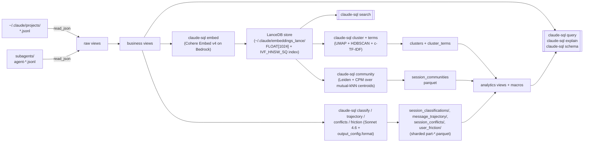

# claude-sql

[](https://github.com/theagenticguy/claude-sql/actions/workflows/ci.yml)
[](https://github.com/theagenticguy/claude-sql/actions/workflows/codeql.yml)
[](https://github.com/theagenticguy/claude-sql/actions/workflows/semgrep.yml)
[](https://securityscorecards.dev/viewer/?uri=github.com/theagenticguy/claude-sql)
[](https://codecov.io/gh/theagenticguy/claude-sql)
[](https://www.python.org/downloads/release/python-3130/)
[](./LICENSE)

> **Ask your Claude Code transcripts anything.**
> Your sessions are already on disk. `claude-sql` turns them into a
> searchable, explorable, self-improving record of your work — in place,
> with zero copy.

## What you get out of it

**Remember what you worked on.**

- "What was that thing I did last Tuesday with DuckDB and HNSW?"
- "Show me every conversation I've had about temporal workflows, ranked by
  relevance."
- "Which week did I finally figure out that memory bug?"

**See where your time and money actually go.**

- "Which sessions cost me more than $5 on Opus this month — and what was I
  trying to do?"
- "Which tools am I leaning on most? Which ones fail the most?"
- "Where am I spending hours on prose vs. on tool calls?"

**Notice patterns in how you work.**

- "When do I hand-hold the agent step-by-step vs. let it run on its own?
  Has that shifted over time?"
- "What kinds of work am I doing most — coding, strategy, admin, writing?"
- "Which session types actually finish successfully vs. trail off?"
- "Which todos do I create and never close out?"

**Surface themes across hundreds of conversations.**

- "Group my sessions by what they're *about* and tell me what moved this
  month."
- "Show me the biggest themes in my work and what's trending."
- "When I've wrestled with the same problem across multiple sessions,
  group them together so I can see the arc."

**Catch yourself disagreeing with yourself.**

- "Find sessions where I took two opposing positions on the same decision
  — and flag which ones got resolved vs. abandoned."

**Spot where the agent left you hanging.**

- "Which sessions had me pinging for status the most? What was the agent
  doing?"
- "Show me every time I asked a one-word question like *screenshot?*
  because the agent didn't proactively share one."
- "Rank sessions by how often I had to interrupt or correct the agent."

`claude-sql` turns every one of those into a SQL query that runs in under
a second on the live JSONL corpus — no export, no pipeline.

## How it works



Every parquet is cached and rebuilt only on explicit re-run. Views
register over whichever parquets exist at connection open — missing ones
warn and no-op, never crash.

## Install

### As a uv tool (recommended)

`claude-sql` is published to [PyPI](https://pypi.org/project/claude-sql/).
Install the CLI into an isolated, uv-managed venv on your `PATH`:

```bash
uv tool install claude-sql
claude-sql --version

uv tool upgrade claude-sql      # pull the latest release
uv tool uninstall claude-sql    # remove it
```

Or run it without installing anything persistent:

```bash
uvx claude-sql schema
```

### From a local checkout (latest unreleased commits)

To run ahead of the last PyPI release, install from a clone.
`mise run tool:install` wraps `uv tool install --from . claude-sql
--force --reinstall`:

```bash
git clone https://github.com/theagenticguy/claude-sql.git
cd claude-sql
mise run tool:install     # → uv tool install --from . claude-sql --force --reinstall
claude-sql --version
```

Upgrade after pulling new commits by re-running the same task (the
`tool:upgrade` alias runs an identical command with clearer intent):

```bash
git pull
mise run tool:upgrade     # reinstall from the checkout, not from PyPI
mise run tool:uninstall   # → uv tool uninstall claude-sql
```

### Project install (for development)

```bash
git clone https://github.com/theagenticguy/claude-sql.git
cd claude-sql
mise install              # fetch pinned Python + uv
mise run install          # uv sync --all-extras + install lefthook git hooks
mise run check            # ruff + fmt + ty + pytest
```

`mise` auto-activates `.venv` on `cd`. Every command below is also
available as a mise task — run `mise tasks` for the full list.

`mise run install` also installs the lefthook git hooks. Re-run
`mise run hooks:install` any time `lefthook.yml` changes.

### AWS credentials

Semantic search and Sonnet classification require Bedrock access.

```bash
export AWS_PROFILE=your-profile
```

The IAM policy needs `bedrock:InvokeModel` on:

- `inference-profile/global.cohere.embed-v4:0`
- `inference-profile/global.anthropic.claude-sonnet-4-6`

### Reading transcripts from S3

claude-sql reads the local JSONL corpus by default, but any transcript glob
can be an `s3://` URI instead — point it at sessions mirrored to S3 by the
[`claude-agent-sdk` `S3SessionStore`](https://github.com/anthropics/claude-agent-sdk-python/tree/main/examples/session_stores)
(layout `s3://{bucket}/{prefix}{project}/{session}/part-*.jsonl`). DuckDB reads
the parts zero-copy over HTTP range requests — no download step — and every
view and macro works unchanged.

```bash
# Personal corpus on S3 instead of ~/.claude/projects.
export CLAUDE_SQL_DEFAULT_GLOB='s3://my-bucket/transcripts/*/*/part-*.jsonl'
export AWS_PROFILE=your-profile        # credentials via the standard AWS chain
claude-sql schema
claude-sql query "SELECT session_id, started_at FROM sessions ORDER BY started_at DESC LIMIT 10"
```

claude-sql loads DuckDB's `httpfs` extension and creates a `credential_chain`
S3 secret automatically when it sees an `s3://` glob — no keys are embedded
anywhere. For a non-AWS store (MinIO) or a local mock, set
`CLAUDE_SQL_S3_ENDPOINT`, `CLAUDE_SQL_S3_URL_STYLE=path`, and
`CLAUDE_SQL_S3_USE_SSL=false`. The IAM policy needs `s3:GetObject` +
`s3:ListBucket` on the prefix.

## Quick tour

```bash
# Inspect every registered view + macro.
claude-sql schema

# Opus sessions over $5 in the last 30 days.
claude-sql query "
  SELECT session_id, model_used(session_id) AS model,
         cost_estimate(session_id) AS usd
  FROM sessions
  WHERE started_at >= current_timestamp - INTERVAL 30 DAY
    AND model_used(session_id) LIKE '%opus%'
    AND cost_estimate(session_id) > 5.0
  ORDER BY usd DESC
"

# See the EXPLAIN plan (static by default — no execution).
claude-sql explain "SELECT * FROM messages WHERE session_id = '<uuid>' LIMIT 1"

# Drop into the DuckDB REPL with everything pre-registered.
claude-sql shell

# Backfill embeddings (Cohere Embed v4 via global CRIS).
claude-sql embed --since-days 30

# Semantic search.
claude-sql search "temporal workflow determinism" --k 10

# Classify every recent session (dry-run prints a cost estimate first).
claude-sql classify --dry-run --since-days 30
claude-sql classify --no-dry-run --since-days 30

# Friction classifier — status pings, unmet expectations, interruptions.
claude-sql friction --dry-run --since-days 14
claude-sql friction --no-dry-run --since-days 14
claude-sql query "SELECT * FROM friction_counts(14)"
claude-sql query "SELECT * FROM friction_examples('unmet_expectation', 10)"

# Seed the Skills catalog from ~/.claude/skills + ~/.claude/plugins/cache.
claude-sql skills sync
claude-sql skills ls --kind plugin-skill | head
claude-sql query "SELECT * FROM skill_rank(30) LIMIT 15"
claude-sql query "SELECT * FROM skill_source_mix(30) WHERE skill_id LIKE '%erpaval%'"
claude-sql query "SELECT * FROM unused_skills(30) LIMIT 20"

# Full analytics pipeline (includes a zero-cost `skills sync` at step 0).
claude-sql analyze --since-days 30 --no-dry-run

# Provenance: resolve a merged commit back to the transcript that wrote it.
claude-sql resolve "$(git rev-parse HEAD)"
claude-sql review-sheet "$(git rev-parse HEAD)" --no-dry-run

# Eval gym: pre-register a study, run the judge panel, gate on agreement.
claude-sql judges
claude-sql freeze rubric.yaml --panel kimi-k2.5,deepseek-v3.2,glm-5
claude-sql judge <manifest_sha> --sessions-parquet sessions.parquet \
  --output-parquet scores.parquet --no-dry-run
claude-sql kappa scores.parquet --floor 0.6
```

More recipes in [`docs/cookbook.md`](docs/cookbook.md) (v1: sessions,
messages, tools, todos, subagents, semantic search) and
[`docs/analytics_cookbook.md`](docs/analytics_cookbook.md) (v2: clusters,
communities, classifications, trajectory, conflicts, friction).

## CLI surface

Every subcommand shares the top-level flags: `--verbose` / `--quiet`,
`--glob`, `--subagent-glob`, and `--format {auto,table,json,ndjson,csv}`.
The LLM-classification commands (`classify`, `trajectory`, `conflicts`,
`friction`, `analyze`, `judge`, `review-sheet`) and the cache-rewriting
ones (`cache compact`, `cache migrate`, `ingest`) default to `--dry-run`.
`embed` and `search` are the exceptions — they spend Bedrock the moment
you call them (an `embed` backfill and a single query-vector call,
respectively), so they have no dry-run gate.

**Query + introspection (zero cost)**

| Command | Purpose |
|---|---|
| `schema` | List every view + its columns, plus every macro |
| `query <sql>` | Run a query, emit as table / JSON / NDJSON / CSV |
| `explain <sql>` | Static `EXPLAIN` by default; `--analyze` for `EXPLAIN ANALYZE` |
| `shell` | Launch the `duckdb` REPL with everything pre-registered |
| `list-cache` | Report freshness + row counts for every parquet cache |
| `peek <session_id>` | One-shot session summary — line count, role mix, top tools, samples |
| `manifest` | Machine-readable JSON manifest of every command, flag, and exit code |

**Embeddings + structure**

| Command | Purpose |
|---|---|
| `embed` | Backfill embeddings via Cohere Embed v4 on Bedrock (spends by default) |
| `search <text>` | IVF_HNSW_SQ cosine semantic search over the LanceDB store |
| `ingest` | Stamp messages with `approx_tokens` / `simhash64` / canonical UUID (CPU only) |
| `cluster` | UMAP → HDBSCAN over message embeddings (CPU only; `--force` to rebuild) |
| `terms` | c-TF-IDF term labels per cluster (CPU only) |
| `community` | Leiden + CPM over mutual-kNN session centroids; emits medoid + coherence + resolution profile + `--neighbors-of` |

**LLM analytics (Sonnet 4.6 — default `--dry-run`)**

| Command | Purpose |
|---|---|
| `classify` | Session autonomy + work category + success + goal |
| `trajectory` | Per-window sentiment + transition kind |
| `conflicts` | Per-session stance-conflict detection |
| `friction` | Regex + Sonnet 4.6 → status pings, unmet expectations, confusion, etc. |
| `analyze` | Run the whole pipeline in dependency order (skills → ingest → embed → cluster → terms → community → classify → trajectory → conflicts → friction) |

**Skills catalog + cache maintenance**

| Command | Purpose |
|---|---|
| `skills sync` | Walk `~/.claude/skills/` + `~/.claude/plugins/cache/` → seedable skills catalog |
| `skills ls` | List catalog entries, filterable by `--kind` and `--plugin` |
| `cache compact` | Consolidate a sharded `<cache>/part-*.parquet` directory into one file |
| `cache migrate` | Move a legacy single-file cache into the sharded directory layout |

**Eval gym (cross-provider judge panels + agreement gates)**

| Command | Purpose |
|---|---|
| `judges` | List the cross-provider Bedrock judge catalog |
| `freeze <rubric>` | Pre-register a study — write an immutable manifest under `~/.claude/studies/<sha>/` |
| `replay <manifest_sha>` | Load + echo a frozen study manifest by SHA |
| `blind-handover <in> <out>` | Strip identity markers from a sessions parquet for grader-safe handover |
| `judge <manifest_sha>` | Dispatch a frozen study's judge panel over a sessions parquet |
| `ungrounded-claim <manifest_sha>` | Run the ungrounded-claim detector over a turns parquet |
| `kappa <scores_parquet>` | Cohen's + Fleiss' kappa with bootstrapped 95% CI; exit 66 below the floor |

**Transcript ↔ PR provenance (RFC 0001)**

| Command | Purpose |
|---|---|
| `bind` | Attach a transcript↔commit binding (trailers + git-notes) to a commit |
| `resolve <commit_sha>` | Resolve a commit's bound transcript (trailer → note precedence) |
| `review-sheet <commit_sha>` | Render a compressed PR review sheet (Sonnet 4.6) |

### Agent-friendly defaults

- **`--format auto`** emits a human table on a TTY and JSON when stdout
  is piped, so agents calling `claude-sql` via subprocess get JSON for
  free. `json`, `ndjson`, and `csv` are always available explicitly.
- **Classified exit codes** for DuckDB errors — `64` for invalid input
  (malformed flags **or** unparseable SQL), `65` for unknown view /
  column / macro, `70` for other runtime errors, and `2` when `search`
  is called before `embed` has run (also reused when `resolve` /
  `review-sheet` find no binding). Two command-specific codes: `kappa`
  exits `66` when an agreement floor or delta-gate is tripped, and
  `shell` exits `127` when the system `duckdb` binary isn't on `PATH`.
  On non-TTY stdout the error also comes back as
  `{"error": {"kind", "message", "hint"}}` on stderr, so agents don't
  have to scrape tracebacks.
- **`list-cache`** reports every parquet (embeddings, classifications,
  trajectory, conflicts, clusters, cluster terms, communities,
  friction) with its `{exists, bytes, mtime, rows}`, so an agent can
  decide whether to run a prerequisite stage before issuing a `search`
  or `query`.
- **`explain`** is a static plan by default (no query execution); pass
  `--analyze` for `EXPLAIN ANALYZE` when you want real timings.
- **`--quiet`** drops INFO / WARNING logs to ERROR-only. View
  registration happens at DEBUG level, so the default `query` stderr is
  already empty unless something actually warrants attention.

## Views

| View | Grain | Key columns |
|---|---|---|
| `sessions` | one per transcript file | `session_id`, `started_at`, `ended_at` |
| `messages` | one per chat message | `uuid`, `session_id`, `role`, `model`, token usage |
| `content_blocks` | flattened `message.content[]` | `block_type`, `tool_name` |
| `messages_text` | text blocks aggregated per message (≥32 chars) | `uuid`, `text_content` |
| `turn_window` | adjacent-turn `LAG` window per session (compact-summary excluded) | `prev_uuid`, `curr_uuid`, `gap_ms`, `window_idx` |
| `tool_calls` | `content_blocks` where `type='tool_use'` | `tool_name`, `tool_use_id` |
| `tool_results` | `content_blocks` where `type='tool_result'` | `tool_use_id`, `content` |
| `todo_events` | one row per todo per `TodoWrite` snapshot (legacy + `--print`/SDK) | `subject`, `status`, `snapshot_ix` |
| `todo_state_current` | latest status per `(session, subject)` for `TodoWrite` | `status`, `written_at` |
| `subagent_spawns` | `Task` / `Agent` launch sites (Claude Code v2.1.63 renamed `Task`→`Agent`) | `subagent_type`, `description`, `prompt` |
| `task_creations` | `TaskCreate` / `mcp__tasks__task_create` (interactive task tracker, v2.1.16+) | `subject`, `description`, `active_form`, `metadata` |
| `task_updates` | `TaskUpdate` / `mcp__tasks__task_update` lifecycle events | `task_id`, `status`, `add_blocked_by`, `owner` |
| `tasks_state_current` | latest status per `(session, task_id)` for the v2.1.16+ family | `task_id`, `subject`, `status`, `last_updated_at` |
| `skill_invocations` | every `Skill` tool call + `<command-name>/foo</command-name>` user slash | `source` (`tool` / `slash_command`), `skill_id`, `args` |
| `subagent_sessions` | rolled-up subagent runs | `parent_session_id`, `agent_hex`, `agent_type`, `description`, `started_at`, `ended_at`, `message_count`, `transcript_path` |
| `subagent_messages` | user + assistant events from subagent transcripts | `uuid`, `parent_session_id` |
| `message_embeddings` | one row per embedded message (LanceDB-backed; empty stub before first `embed`) | `uuid`, `model`, `dim`, `embedding` (`FLOAT[1024]`), `embedded_at` |
| `ingest_stamps` | per-message ingest stamps (seeded by `claude-sql ingest`) | `uuid`, `simhash64`, `canonical_uuid` |
| `session_classifications` | one row per classified session | `autonomy_tier`, `work_category`, `success`, `goal` |
| `session_goals` | projection over classifications | `session_id`, `goal` |
| `message_trajectory` | one row per adjacent-turn window (pair-keyed) | `prev_uuid`, `curr_uuid`, `curr_sentiment`, `delta`, `transition_kind`, `is_transition`, `confidence` |
| `session_conflicts` | one row per conflicting turn pair (zero rows when none) | `turn_a_uuid`, `turn_b_uuid`, `conflict_kind`, `severity`, `agent_position`, `user_position`, `confidence` |
| `conflicts_summary` | per-session conflict count over `session_conflicts` | `session_id`, `conflict_count` |
| `message_clusters` | cluster id + 2d viz coords | `cluster_id`, `x`, `y`, `is_noise` |
| `cluster_terms` | c-TF-IDF top terms per cluster | `cluster_id`, `term`, `weight`, `rank` |
| `session_communities` | Leiden+CPM community per session | `community_id`, `size`, `is_medoid`, `coherence`, `gamma_used` |
| `community_profile` | Resolution-profile sidecar (auto-γ runs only) | `gamma`, `n_communities`, `quality`, `plateau_length` |
| `user_friction` | one row per classified short user message | `label` (7-way), `rationale`, `source` (`regex` / `llm` / `refused`), `confidence` |
| `skills_catalog` | one row per known skill / slash command (seed by `claude-sql skills sync`) | `skill_id`, `name`, `plugin`, `plugin_version`, `source_kind` (`user-skill` / `plugin-skill` / `plugin-command` / `builtin`), `description` |
| `skill_usage` | `skill_invocations` ⟕ `skills_catalog` | `source`, `skill_id`, `skill_name`, `plugin`, `is_builtin`, `description` |

## Macros

| Macro | Signature | What it does |
|---|---|---|
| `ago(interval_text)` | scalar → `TIMESTAMP` | `current_timestamp - INTERVAL <text>` -- e.g. `WHERE ts >= ago('30 days')` |
| `model_used(sid)` | scalar → `VARCHAR` | Latest `model` observed in the session |
| `cost_estimate(sid)` | scalar → `DOUBLE` | USD spend (dated model IDs prefix-matched) |
| `tool_rank(last_n_days)` | table | Tool-use leaderboard over a window |
| `todo_velocity(sid)` | scalar → `DOUBLE` | Completed / distinct todos ratio |
| `subagent_fanout(sid)` | scalar → `INT` | Subagent runs for a session |
| `semantic_search(query_vec, k)` | table | HNSW top-k over embeddings |
| `autonomy_trend(window_days)` | table | Weekly autonomy-tier mix |
| `work_mix(since_days)` | table | Work-category distribution |
| `success_rate_by_work(since_days)` | table | Success / failure / partial rates per category, over *known* outcomes (excludes `unknown`); also returns `known_sessions` + `unknown_fraction` |
| `cluster_top_terms(cid, n)` | table | Top-N terms for a cluster |
| `community_top_topics(cid, n)` | table | Dominant clusters within a community |
| `sentiment_arc(sid)` | table | Per-window sentiment timeline for one session |
| `friction_counts(since_days)` | table | Count + session breadth per friction label |
| `friction_rate(since_days)` | table | Per-session friction pressure vs. user message count |
| `friction_examples(label_name, n)` | table | Top-N example messages for a friction label |
| `skill_rank(last_n_days)` | table | Skill / slash leaderboard over a window (counts both `tool` and `slash_command` sources) |
| `skill_source_mix(last_n_days)` | table | Per skill `n_tool` vs. `n_slash` — how is each skill invoked? |
| `unused_skills(last_n_days)` | table | Catalog entries with zero invocations in the window (needs `skills sync`) |
| `canonical_uuid_resolve()` | table | SimHash near-duplicate UUID resolution over `ingest_stamps` (needs `claude-sql ingest`) |

## Environment variables

Every setting in `config.py` is overridable via a `CLAUDE_SQL_*` env var
(prefix + the upper-cased field name) or a `.env` in the working
directory. The common knobs are below; the per-stage tuning fields
(`CLAUDE_SQL_UMAP_*`, `CLAUDE_SQL_HDBSCAN_*`, `CLAUDE_SQL_TFIDF_*`, the
`*_THINKING` modes, and each analytics parquet path) follow the same
prefix convention — see `config.py` for the full set.

| Variable | Default | Purpose |
|---|---|---|
| `CLAUDE_SQL_DEFAULT_GLOB` | `~/.claude/projects/*/*.jsonl` | Main transcript glob |
| `CLAUDE_SQL_SUBAGENT_GLOB` | `~/.claude/projects/*/*/subagents/agent-*.jsonl` | Subagent transcripts |
| `CLAUDE_SQL_TEAM_CORPUS_ROOT` | `None` | Team-corpus root; when set, derives all three globs from `<root>/<author>/projects/*` (replaces the personal corpus) |
| `CLAUDE_SQL_S3_ENDPOINT` | `None` | Custom S3 endpoint `host[:port]` for non-AWS stores (MinIO) or a local mock; unset uses default AWS S3. Only consulted when a glob is an `s3://` URI |
| `CLAUDE_SQL_S3_URL_STYLE` | `vhost` | S3 addressing style (`vhost` or `path`); set `path` for MinIO / moto |
| `CLAUDE_SQL_S3_USE_SSL` | `true` | Toggle TLS for the S3 endpoint; set `false` for a local mock |
| `CLAUDE_SQL_REGION` | `us-east-1` | Bedrock region **and** the S3 secret region |
| `CLAUDE_SQL_MODEL_ID` | `global.cohere.embed-v4:0` | Embedding model |
| `CLAUDE_SQL_SONNET_MODEL_ID` | `global.anthropic.claude-sonnet-4-6` | Classification model |
| `CLAUDE_SQL_OUTPUT_DIMENSION` | `1024` | Matryoshka embedding dimension (`256` / `512` / `1024` / `1536`) |
| `CLAUDE_SQL_EMBEDDING_TYPE` | `int8` | Cohere output type (`int8` / `float` / `uint8` / `binary` / `ubinary`) |
| `CLAUDE_SQL_EMBED_CONCURRENCY` | `8` | Parallel Cohere Embed v4 calls (global CRIS) |
| `CLAUDE_SQL_LLM_CONCURRENCY` | `16` | Parallel Sonnet 4.6 calls (global CRIS) |
| `CLAUDE_SQL_BATCH_SIZE` | `96` | Cohere batch size |
| `CLAUDE_SQL_LANCE_URI` | `~/.claude/embeddings_lance` | LanceDB embeddings store (`FLOAT[1024]` vectors + IVF_HNSW_SQ index) |
| `CLAUDE_SQL_HNSW_METRIC` | `cosine` | Vector index distance metric (`cosine` / `l2` / `dot`) |
| `CLAUDE_SQL_EMBEDDINGS_PARQUET_PATH` | `~/.claude/embeddings/` | **Legacy** parquet shards; kept only for one-time migration into LanceDB |
| `CLAUDE_SQL_USER_FRICTION_PARQUET_PATH` | `~/.claude/user_friction/` | Friction cache (sharded) |
| `CLAUDE_SQL_FRICTION_MAX_CHARS` | `300` | Short-message cutoff for the friction classifier |
| `CLAUDE_SQL_DUCKDB_THREADS` | `os.cpu_count()` | DuckDB worker threads |
| `CLAUDE_SQL_DUCKDB_MEMORY_LIMIT` | `'70%'` | DuckDB memory ceiling (percentage or absolute size) |
| `CLAUDE_SQL_DUCKDB_TEMP_DIR` | `~/.claude/duckdb_tmp` | DuckDB spill directory (avoids `/tmp` tmpfs thrash) |
| `CLAUDE_SQL_SKILLS_CATALOG_PARQUET_PATH` | `~/.claude/skills_catalog.parquet` | Skills catalog parquet |
| `CLAUDE_SQL_USER_SKILLS_DIR` | `~/.claude/skills` | Root scanned for user-installed skills |
| `CLAUDE_SQL_PLUGINS_CACHE_DIR` | `~/.claude/plugins/cache` | Root scanned for plugin skills + commands |
| `CLAUDE_SQL_SEED` | `42` | UMAP / HDBSCAN / Leiden determinism |
| `CLAUDE_SQL_LEIDEN_KNN_K` | `15` | Mutual-kNN k for the session-centroid graph |
| `CLAUDE_SQL_LEIDEN_EDGE_FLOOR` | `0.3` | Cosine floor below which edges are dropped |
| `CLAUDE_SQL_LEIDEN_MIN_COMMUNITY_SIZE` | `3` | Communities below this collapse to noise (`-1`) |
| `CLAUDE_SQL_LEIDEN_RESOLUTION` | unset (auto) | Explicit CPM γ; skips the resolution profile |
| `CLAUDE_SQL_LEIDEN_RESOLUTION_RANGE_LO` | `0.05` | Lower bound for `Optimiser.resolution_profile` bisection |
| `CLAUDE_SQL_LEIDEN_RESOLUTION_RANGE_HI` | `0.95` | Upper bound for the bisection |
| `CLAUDE_SQL_LEIDEN_N_ITERATIONS` | `-1` | Iterate to convergence; `2` is leidenalg's default |
| `CLAUDE_SQL_COMMUNITY_PROFILE_PARQUET_PATH` | `~/.claude/community_profile.parquet` | Resolution-profile sidecar path |

## Development

```bash
mise run check           # lint + fmt-check + typecheck + tests
mise run fmt:write       # auto-apply ruff formatting
mise run upgrade         # uv lock --upgrade && uv sync
mise run build           # uv build → dist/*.whl + *.tar.gz
mise run tool:install    # install claude-sql as a uv tool (global)
mise run cli -- schema   # run the CLI in the project venv
mise tasks               # list every mise task
```

### Git hooks + conventional commits

`mise run install` installs **lefthook** git hooks:

- **pre-commit** — parallel `ruff check --fix` + `ruff format` on staged
  Python files (auto-staged), `ty check src/ tests/` across the whole tree
  (strict mode), and `uv lock --check` when `pyproject.toml` or `uv.lock`
  is staged.
- **commit-msg** — validates the message via `cz check --allow-abort`
  against the conventional-commits schema.
- **pre-push** — runs the full pytest suite before the push lands.

Config lives in `lefthook.yml`. Reinstall any time that file changes:

```bash
mise run hooks:install
mise run hooks:uninstall   # if you need to opt out
```

### Version bumps + changelog (commitizen)

Commit messages follow
[Conventional Commits](https://www.conventionalcommits.org/). Supported
types: `feat`, `fix`, `docs`, `style`, `refactor`, `perf`, `test`,
`build`, `ci`, `chore`, `revert`. Use `mise run commit` for the
interactive wizard, or write the message yourself — either way the
`commit-msg` hook validates it.

Version bumps are driven by `cz bump`, which reads commit history and
decides MAJOR / MINOR / PATCH from the conventional-commits types:

```bash
mise run bump:dry-run    # preview next version + tag
mise run bump            # bump + changelog + annotated tag (vX.Y.Z)
mise run changelog       # regenerate CHANGELOG.md without bumping
```

`[tool.commitizen]` is wired to `version_provider = "uv"`, so every bump
keeps `pyproject.toml[project.version]` and `uv.lock` in sync
atomically.

### Quality gates

Local `mise run check` (`lint + fmt + typecheck + test`) and GitHub
Actions run the same commands against the same pinned tool versions (via
`jdx/mise-action`), so contributors who pass the hooks locally can trust
CI agrees. On top of the local gate, CI layers in:

- **Semgrep** — `p/auto` + `p/owasp-top-ten` rulesets, SARIF uploaded
  to GitHub code scanning.
- **Bandit** — Python SAST as defense-in-depth alongside ruff's
  `flake8-bandit` (`S`) selectors. Principled skips align 1:1 with the
  ruff S-ignores in `pyproject.toml`. SARIF to code scanning.
- **CodeQL** — `security-and-quality` query pack, weekly cron.
- **OSV-Scanner** — known-CVE scan of `uv.lock`, fails on findings.
- **Betterleaks** — secrets sweep over full git history (gitleaks
  successor). SARIF to code scanning.
- **OpenSSF Scorecard** — weekly, SARIF to code scanning.
- **Codecov** — coverage.xml uploaded via tokenless OIDC.
- **CycloneDX SBOM** — generated + attached on every release.

### Local security sweep

`mise run security` runs all four SAST/SCA/secrets scanners in parallel
against the working tree:

```bash
mise run security              # bandit + semgrep + osv + leaks → .sarif/
mise run security:bandit       # individual scanners also runnable
mise run security:semgrep
mise run security:osv
mise run security:leaks
```

Each scanner emits SARIF under `.sarif/` (gitignored). The local sweep
mirrors what CI uploads to GitHub code scanning, so contributors can
reproduce findings without waiting on CI. All four use the
"report, don't gate" pattern (`--exit-zero` / `--exit-code=0`) — gating
happens through code-scanning branch protection, not the scanner exit.
See `.erpaval/solutions/best-practices/sarif-scanner-report-vs-gate.md`
for the rationale.

See `docs/adr/0015-stack-modernization.md` and
`docs/adr/0016-ci-hardening.md` for the full rationale.

## Design notes

- **Zero-copy reads.** `read_json(..., filename=true, union_by_name=true,
  sample_size=-1, ignore_errors=true)` so the corpus is queried in place.
- **Lazy content blocks.** Nested `message.content[]` stays as JSON and
  flattens via `UNNEST + json_extract_string`, not eagerly shredded —
  resilient to new block types (`thinking`, MCP shapes, etc.).
- **Global CRIS for Cohere.** The `global.cohere.embed-v4:0` profile
  sustains the highest throughput with no throttling in testing; direct
  and US CRIS both saturate at low TPM.
- **LanceDB embeddings store.** Vectors and the cosine-metric
  `IVF_HNSW_SQ` (scalar-quantized HNSW) index live together in one
  versioned LanceDB dataset at `~/.claude/embeddings_lance/`; DuckDB
  reads it back via the `lance` core extension
  (`INSTALL lance; LOAD lance; ATTACH … (TYPE LANCE)`). On a fresh
  install with no Lance table yet, `register_vss` binds an empty
  `message_embeddings` stub so `semantic_search` still resolves. This
  replaces the old `embeddings/part-*.parquet` + `~/.claude/hnsw.duckdb`
  rebuild-at-open combo; the legacy shards migrate over automatically on
  first connect. Recovery: `rm -rf ~/.claude/embeddings_lance/` then
  `claude-sql embed`.
- **Structured output, GA path.** Sonnet 4.6 classification uses
  Bedrock's GA `output_config.format` (not `tool_use` / `tool_choice`)
  with adaptive thinking on. Pydantic v2 schemas are flattened (inline
  `$ref`, inject `additionalProperties: false`, strip the numeric /
  string constraints the validator rejects from Draft 2020-12).
- **Determinism.** UMAP, HDBSCAN, and Leiden all seed from
  `CLAUDE_SQL_SEED=42` (default) so cluster IDs and community IDs are
  stable across reruns. The Leiden seed flows into both
  `leidenalg.find_partition(seed=...)` and `Optimiser.set_rng_seed(...)`
  for the resolution-profile bisection — same seed + same input ⇒
  byte-equal parquets across runs.
- **Communities = `leidenalg` + CPM.** Reference Leiden implementation
  (`leidenalg>=0.11.0`) over an `igraph>=1.0` mutual-kNN cosine graph
  (k=15, edge floor 0.3) of session centroids. CPM γ has direct cosine
  semantics (internal density ≥ γ, external ≤ γ); auto-γ via
  `Optimiser.resolution_profile` + longest-plateau picker; warn-only
  connectivity check. Output is signal-rich: `is_medoid`, `coherence`,
  `gamma_used` per row, plus a `community_profile` sidecar with one row
  per γ tested, so an LLM agent can ask "what γ would yield 50
  communities?" without rerunning Leiden. Top terms per community come
  from the live `community_top_topics(cid, n)` macro composed from
  `cluster_terms`, not a frozen column. See
  [`docs/research_notes.md`](docs/research_notes.md) for the
  Louvain → Leiden+CPM swap rationale.
- **Hybrid friction pipeline.** A hand-curated regex bank catches the
  unambiguous `status_ping` / `interruption` / `correction` cases at
  zero Bedrock cost; the ambiguous class — especially
  `unmet_expectation` (one-word questions like `screenshot?` that imply
  the agent missed a proactive step) — falls through to Sonnet 4.6
  structured output. Scoped to user-role messages under 300 characters
  by default; longer turns are almost always genuine task instructions.
- **Pre-registered eval gym.** The `judges` / `freeze` / `judge` /
  `kappa` family grades transcripts with a cross-provider Bedrock judge
  panel (8 non-Anthropic/non-Amazon primaries + a within-family
  Anthropic holdout to measure self-preference bias), then scores
  inter-rater agreement with Cohen's + Fleiss' kappa and bootstrapped
  95% CIs. `freeze` writes an immutable study manifest under
  `~/.claude/studies/<sha>/` so a run is reproducible (`replay`);
  `blind-handover` strips identity markers before grading; `kappa`
  exits `66` below the agreement floor. No DuckDB views or `list-cache`
  parquets — output goes to caller-named parquets stamped with the
  freeze SHA.
- **Transcript ↔ PR provenance.** `bind` writes a host-neutral binding
  between a merged commit and the transcript that produced it, encoded
  as three `git-interpret-trailers` trailers plus a JSON note under
  `refs/notes/transcripts`. `resolve` reads it back (trailer-first,
  note-fallback, loud on digest disagreement); `review-sheet` compresses
  the bound transcript into a Markdown/JSON PR review sheet via Sonnet
  4.6. Pure-stdlib, no new git infrastructure — see
  [`docs/rfc/0001-transcript-pr-binding.md`](docs/rfc/0001-transcript-pr-binding.md).

See [`docs/research_notes.md`](docs/research_notes.md) for deeper design
rationale, and
[`docs/rfc/0002-vision-and-roadmap.md`](docs/rfc/0002-vision-and-roadmap.md)
for the data-model + roadmap direction.

## Links

- [Cookbook (v1)](docs/cookbook.md) — sessions, messages, tools, todos,
  subagents, semantic search.
- [Analytics cookbook (v2)](docs/analytics_cookbook.md) — clusters,
  communities, classifications, trajectory, conflicts, friction.
- [Research notes](docs/research_notes.md) — design decisions and
  tuning knobs.
- [JSONL schema reference](docs/jsonl_schema_v1.sql) — column listings
  for every registered view.
- [RFC 0001 — transcript ↔ PR binding](docs/rfc/0001-transcript-pr-binding.md)
  — the `bind` / `resolve` / `review-sheet` convention.
- [RFC 0002 — vision + roadmap](docs/rfc/0002-vision-and-roadmap.md) —
  the v2 data model and production direction.

## License

Apache 2.0. See [LICENSE](LICENSE).
