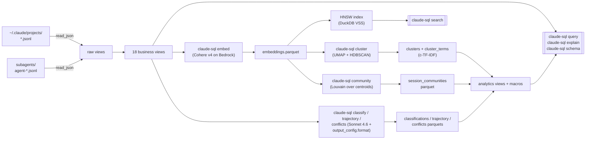

# claude-sql

> Every Claude Code session you've ever run, queryable in SQL — without an
> ETL step.

`claude-sql` points DuckDB at `~/.claude/projects/**/*.jsonl` and gives you
a first-class analytics surface over your own transcripts: sessions,
messages, tool calls, todos, subagents, semantic search via Cohere Embed
v4, HDBSCAN message clusters, Louvain session communities, and
Sonnet-4.6-driven session/message classifications. All joinable in a
single SQL query. Zero copy, zero ingestion.

## Why you'd use this

You've had hundreds of conversations with Claude. The transcripts are
already on disk. You can't answer any of these today:

- Which sessions used Opus and cost me more than $5 in the last 30 days?
- What topics have I been working on this month? Which clusters grew or
  shrank week-over-week?
- Where did I spend the most time in tool calls vs. prose? Which tools
  succeeded, which ones errored out?
- What's my *autonomy tier* distribution — when do I hand-hold the agent
  vs. when does it run autonomously? Has it shifted over time?
- Which sessions ended in success vs. unresolved vs. abandoned?
- Show me every session I've had about `DuckDB HNSW` semantically
  (not just keyword-matched).
- Which todo subjects did I create but never mark complete?
- Which of my sessions spawn the most subagents? Which subagent types?
- Is the work mix trending toward SDE, strategy, or admin?
- Find every time a message contradicts a previous stance in the same
  session — and how those conflicts resolved.

`claude-sql` turns every one of those into a SQL query that runs in under
a second on the live JSONL corpus (no export, no pipeline).

## How it works



Every parquet is cached and rebuilt only on explicit re-run; views register
over whichever parquets exist at connection open (missing ones warn and
no-op).

## Install

### As a uv tool (recommended)

This installs `claude-sql` into an isolated venv and puts it on your PATH
globally.

```bash
# From the git repo
git clone https://github.com/theagenticguy/claude-sql.git
cd claude-sql
mise run tool:install     # → uv tool install --from . claude-sql --force
claude-sql --version
```

Or one-shot from the source tree:

```bash
uv tool install --from . claude-sql
```

Update in place later:

```bash
uv tool upgrade claude-sql
```

Remove:

```bash
mise run tool:uninstall   # → uv tool uninstall claude-sql
```

### Project install (for development)

```bash
git clone https://github.com/theagenticguy/claude-sql.git
cd claude-sql
mise install              # fetch pinned Python 3.12 + uv
mise run install          # uv sync --all-extras
mise run check            # ruff + fmt + ty + pytest
```

`mise` auto-activates `.venv` on `cd`. Every command below is also
available as a mise task: `mise tasks` prints the full list.

### AWS creds

Semantic search + Sonnet classification require Bedrock access.

```bash
export AWS_PROFILE=your-profile
```

The IAM policy needs `bedrock:InvokeModel` on
`inference-profile/global.cohere.embed-v4:0` and
`inference-profile/global.anthropic.claude-sonnet-4-6`.

## Quick tour

```bash
# Inspect every registered view + macro
claude-sql schema

# Answer the work-item acceptance prompt
claude-sql query "
  SELECT session_id, model_used(session_id) AS model,
         cost_estimate(session_id) AS usd
  FROM sessions
  WHERE started_at >= current_timestamp - INTERVAL 30 DAY
    AND model_used(session_id) LIKE '%opus%'
    AND cost_estimate(session_id) > 5.0
  ORDER BY usd DESC
"

# See the EXPLAIN ANALYZE plan with pushdown markers highlighted
claude-sql explain "SELECT * FROM messages WHERE session_id = '...' LIMIT 1"

# Drop into the DuckDB REPL with everything pre-registered
claude-sql shell

# Backfill embeddings (Cohere Embed v4 global CRIS)
AWS_PROFILE=... claude-sql embed --since-days 30

# Semantic search
claude-sql search "temporal workflow determinism" --k 10

# Classify every recent session (dry-run prints a cost estimate first)
claude-sql classify --dry-run --since-days 30
AWS_PROFILE=... claude-sql classify --no-dry-run --since-days 30

# Full analytics pipeline (embed → cluster → classify → trajectory → conflicts)
AWS_PROFILE=... claude-sql analyze --since-days 30 --no-dry-run
```

More recipes in [docs/analytics_cookbook.md](docs/analytics_cookbook.md).

## CLI surface

All 12 subcommands follow the same shape: shared `--verbose`/`--quiet`,
`--glob`, `--subagent-glob` flags on the top level; per-command flags as
documented. Commands that spend real Bedrock money default to `--dry-run`.

| Command | Purpose |
|---|---|
| `schema` | List every view + its columns, plus every macro |
| `query <sql>` | Run a query, print the polars table |
| `explain <sql>` | `EXPLAIN ANALYZE` with pushdown markers highlighted |
| `shell` | Launch the `duckdb` REPL with everything pre-registered |
| `embed` | Backfill embeddings via Cohere Embed v4 on Bedrock |
| `search <text>` | HNSW cosine semantic search over embeddings |
| `classify` | Sonnet 4.6 → session autonomy + work category + success + goal |
| `trajectory` | Per-message sentiment + is_transition |
| `conflicts` | Per-session stance-conflict detection |
| `cluster` | UMAP → HDBSCAN → c-TF-IDF over message embeddings |
| `community` | Louvain over session centroids |
| `analyze` | Run the whole pipeline in dependency order |

## Views

| View | Grain | Key columns |
|---|---|---|
| `sessions` | one per transcript file | `session_id`, `started_at`, `ended_at` |
| `messages` | one per chat message | `uuid`, `session_id`, `role`, `model`, token usage |
| `content_blocks` | flattened `message.content[]` | `block_type`, `tool_name` |
| `messages_text` | text blocks aggregated per message | `uuid`, `text_content` |
| `tool_calls` | `content_blocks` where `type='tool_use'` | `tool_name`, `tool_use_id` |
| `tool_results` | `content_blocks` where `type='tool_result'` | `tool_use_id`, `content` |
| `todo_events` | one row per todo per TodoWrite snapshot | `subject`, `status`, `snapshot_ix` |
| `todo_state_current` | latest status per `(session, subject)` | `status`, `written_at` |
| `task_spawns` | `Task`/`Agent`/`TaskCreate` launch sites | `subagent_type`, `prompt` |
| `subagent_sessions` | rolled-up subagent runs | `parent_session_id`, `agent_type` |
| `subagent_messages` | user+assistant events from subagent transcripts | `uuid`, `parent_session_id` |
| `session_classifications` | one row per classified session | `autonomy_tier`, `work_category`, `success`, `goal` |
| `session_goals` | projection over classifications | `session_id`, `goal` |
| `message_trajectory` | per-message sentiment + is_transition | `sentiment_delta`, `is_transition` |
| `session_conflicts` | per-session stance conflicts | `stance_a`, `stance_b`, `resolution` |
| `message_clusters` | cluster id + 2d viz coords | `cluster_id`, `x`, `y`, `is_noise` |
| `cluster_terms` | c-TF-IDF top terms per cluster | `cluster_id`, `term`, `weight`, `rank` |
| `session_communities` | Louvain community per session | `community_id`, `size` |

## Macros

| Macro | Signature | What it does |
|---|---|---|
| `model_used(sid)` | scalar → VARCHAR | Latest `model` observed in the session |
| `cost_estimate(sid)` | scalar → DOUBLE | USD spend (dated model IDs prefix-matched) |
| `tool_rank(last_n_days)` | table | Tool-use leaderboard over a window |
| `todo_velocity(sid)` | scalar → DOUBLE | Completed / distinct todos ratio |
| `subagent_fanout(sid)` | scalar → INT | Subagent runs for a session |
| `semantic_search(query_vec, k)` | table | HNSW top-k over embeddings |
| `autonomy_trend(window_days)` | table | Weekly autonomy-tier mix |
| `work_mix(since_days)` | table | Work-category distribution |
| `success_rate_by_work(since_days)` | table | success / failure / partial rates per category |
| `cluster_top_terms(cid, n)` | table | Top-N terms for a cluster |
| `community_top_topics(cid, n)` | table | Dominant clusters within a community |
| `sentiment_arc(sid)` | table | Per-message sentiment timeline for one session |

## Environment variables

All configurable via `CLAUDE_SQL_*`:

| Variable | Default | Purpose |
|---|---|---|
| `CLAUDE_SQL_DEFAULT_GLOB` | `~/.claude/projects/*/*.jsonl` | Main transcript glob |
| `CLAUDE_SQL_SUBAGENT_GLOB` | `~/.claude/projects/*/*/subagents/agent-*.jsonl` | Subagent transcripts |
| `CLAUDE_SQL_REGION` | `us-east-1` | Bedrock region |
| `CLAUDE_SQL_MODEL_ID` | `global.cohere.embed-v4:0` | Embedding model |
| `CLAUDE_SQL_SONNET_MODEL_ID` | `global.anthropic.claude-sonnet-4-6` | Classification model |
| `CLAUDE_SQL_OUTPUT_DIMENSION` | `1024` | Matryoshka embedding dim |
| `CLAUDE_SQL_CONCURRENCY` | `2` | Parallel Bedrock calls |
| `CLAUDE_SQL_BATCH_SIZE` | `96` | Cohere batch size |
| `CLAUDE_SQL_EMBEDDINGS_PARQUET_PATH` | `~/.claude/embeddings.parquet` | Embeddings cache |
| `CLAUDE_SQL_SEED` | `42` | UMAP/HDBSCAN/Louvain determinism |

## Development

```bash
mise run check           # lint + fmt-check + typecheck + 40 tests
mise run fmt:write       # auto-apply ruff formatting
mise run upgrade         # uv lock --upgrade && uv sync
mise run build           # uv build → dist/*.whl + *.tar.gz
mise run tool:install    # install claude-sql as a uv tool (global)
mise run cli -- schema   # run the CLI in the project venv
mise tasks               # list every mise task
```

## Design notes

- Zero-copy reads: `read_json(..., filename=true, union_by_name=true,
  sample_size=-1, ignore_errors=true)` so the corpus is queried in place.
- Nested `message.content[]` kept as JSON and flattened via `UNNEST +
  json_extract_string`, not eagerly shredded — resilient to new block
  types.
- Cohere Embed v4 via the `global.cohere.embed-v4:0` CRIS profile sustains
  the highest throughput with no throttling in tests; direct and US CRIS
  both saturate at low TPM.
- HNSW cosine index (`DuckDB VSS`) rebuilt from the parquet on every
  connection open; no experimental persistence.
- Sonnet 4.6 structured output uses Bedrock's GA `output_config.format`
  (not `tool_use` / `tool_choice`) with adaptive thinking on, satisfying
  JSON Schema Draft 2020-12 subset via a pydantic → flattener pipeline
  that inlines `$ref` and strips numeric/string constraints the validator
  rejects.
- UMAP → HDBSCAN runs with `random_state=42` so cluster IDs are stable
  across runs.
- Louvain community detection uses `networkx.community.louvain_communities`
  (built into `networkx>=3.4`), not the abandoned `python-louvain`.

## Links

- Research report: [claude-sql-zero-copy-engine-research.md](../claude-sql-zero-copy-engine-research.md)
  (22 sources)
- Cookbook: [docs/cookbook.md](docs/cookbook.md)
- Analytics cookbook: [docs/analytics_cookbook.md](docs/analytics_cookbook.md)
- Research notes: [docs/research_notes.md](docs/research_notes.md)

## License

Apache 2.0. See [LICENSE](LICENSE).
