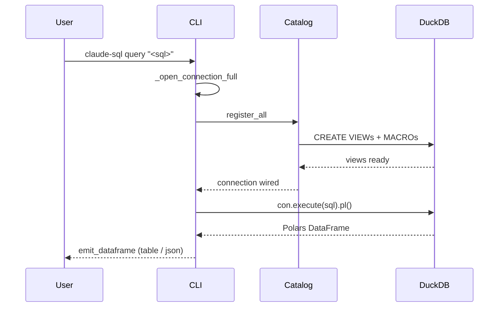
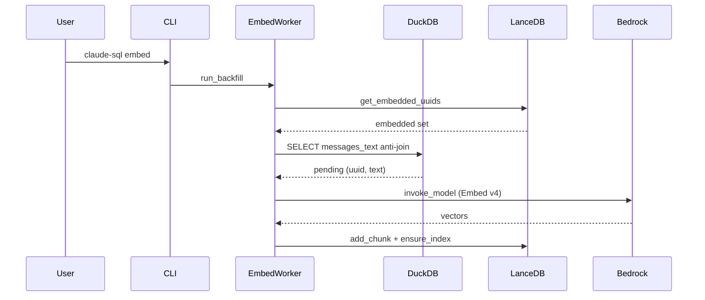
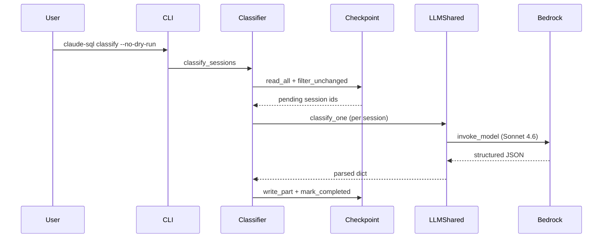

# claude-sql · Data flow

`claude-sql` is a single-process CLI: every flow starts when the user invokes a subcommand from a shell and ends when the binary exits. The three flows below cover the load-bearing read path, the load-bearing write path that calls Bedrock, and the canonical Sonnet-4.6 LLM analytics pipeline that the other classifiers (`trajectory`, `conflicts`, `friction`) replicate.

## Flow 1: claude-sql query <sql>

Read-only DuckDB execution against the registered view + macro catalog over the user's JSONL transcripts. No Bedrock, no LLM, no parquet writes.

1. User invokes `claude-sql query "<sql>"`; Cyclopts dispatches to the `query` command body (`src/claude_sql/cli.py:728`).
2. `query` resolves the merged settings and chooses the connection mode: `_open_connection_full` for SQL that touches the catalog, `_open_connection_introspect` otherwise (`src/claude_sql/cli.py:789-793`).
3. `_open_connection_full` opens an in-memory DuckDB, applies tuning PRAGMAs, and calls `register_all` to wire raw views, derived views, optional VSS, analytics views, and macros (`src/claude_sql/cli.py:356-360`).
4. `register_all` walks `register_raw` → `register_views` → `register_vss` → `register_analytics` → `register_macros` in dependency order (`src/claude_sql/sql_views.py:2126-2143`).
5. `query` hands the user's SQL to DuckDB and asks Polars for the result frame, wrapped by `run_or_die` so DuckDB exceptions become classified errors (`src/claude_sql/cli.py:798`).
6. `run_or_die` either returns the Polars DataFrame or routes a `duckdb.Error` through `classify_duckdb_error` to a `(parse=64 / catalog=65 / runtime=70)` exit (`src/claude_sql/output.py:240-254`).
7. On success, `emit_dataframe` renders the frame: a Polars table on TTY, JSON / NDJSON / CSV otherwise (`src/claude_sql/cli.py:799`).
8. `query` closes the connection in its `finally` block; the process exits 0 (`src/claude_sql/cli.py:802-803`).

## Flow 2: claude-sql embed

Async-fan-out over Cohere Embed v4 on Bedrock. Discovers unembedded messages by anti-joining LanceDB, embeds them in batches of 96 under a concurrency-limiting semaphore, writes vectors back to LanceDB, and ensures the IVF_HNSW_SQ index.

1. User invokes `claude-sql embed`; Cyclopts dispatches to the `embed` command body (`src/claude_sql/cli.py:1397`).
2. `embed` opens a bare DuckDB connection and binds only `register_raw` + `register_views` (no VSS, no analytics) since the worker reads `messages_text` and writes Lance directly (`src/claude_sql/cli.py:1445-1453`).
3. `embed` calls `asyncio.run(run_backfill(...))` to drive the pipeline (`src/claude_sql/cli.py:1454-1462`).
4. `run_backfill` calls `discover_unembedded` to anti-join `messages_text` against the set of UUIDs already present in LanceDB (`src/claude_sql/embed_worker.py:421-426`).
5. `discover_unembedded` reads embedded UUIDs via `lance_store.get_embedded_uuids` and returns the `(uuid, text)` pairs to embed (`src/claude_sql/embed_worker.py:138-178`).
6. `run_backfill` slices the pending list into chunks and calls `embed_documents_async`, which fans batches out under an `asyncio.Semaphore(embed_concurrency)` (`src/claude_sql/embed_worker.py:483`, `src/claude_sql/embed_worker.py:320-344`).
7. Each batch is dispatched to `_invoke_bedrock_sync` via `asyncio.to_thread`, which calls boto3 `invoke_model` against the Cohere Embed v4 CRIS profile and returns int8/float vectors (`src/claude_sql/embed_worker.py:257-264`).
8. `run_backfill` writes each chunk into LanceDB via `lance_store.add_chunk`, then on completion runs `optimize_if_needed` + `ensure_index` so subsequent `search` calls hit a current HNSW index (`src/claude_sql/embed_worker.py:511-524`).

## Flow 3: claude-sql classify

Sonnet 4.6 structured-output classification of full session transcripts. Anti-joins finished sessions against the parquet, skips unchanged sessions via `(last_ts, mtime)` checkpoint, dispatches calls under an `anyio.CapacityLimiter`, parses the structured payload, writes a parquet shard per chunk, and stamps the checkpoint.

1. User invokes `claude-sql classify --no-dry-run`; Cyclopts dispatches to the `classify` command body (`src/claude_sql/cli.py:1568`).
2. `classify` opens a full catalog connection and calls `classify_sessions` (`src/claude_sql/cli.py:1618-1620`).
3. `classify_sessions` enters the `pipeline_cache_stats("classify")` context (Bedrock prompt-cache write/read accounting) and calls `asyncio.run(_classify_sessions_async)` (`src/claude_sql/classify_worker.py:245-254`).
4. `_classify_sessions_async` reads the existing classifications shards via `parquet_shards.read_all`, then computes the unchanged-session skip set via `session_bounds` + `checkpointer.filter_unchanged` (`src/claude_sql/classify_worker.py:54-66`).
5. For each pending `(session_id, text)` returned by `iter_session_texts`, the worker schedules a `classify_one` coroutine under `anyio.CapacityLimiter(llm_concurrency)` (`src/claude_sql/classify_worker.py:76-118`).
6. `classify_one` hands the call to `anyio.to_thread.run_sync(_invoke_classifier_sync)`, which calls Bedrock `invoke_model` with `output_config.format` + 1h-TTL system block + adaptive thinking, then parses the structured payload (`src/claude_sql/llm_shared.py:583-596`, `src/claude_sql/llm_shared.py:441-487`).
7. After each chunk, ok rows are written via `parquet_shards.write_part` to a fresh `<cache>/part-<ts_ns>.parquet` shard (`src/claude_sql/classify_worker.py:149-162`).
8. The worker stamps `checkpointer.mark_completed` for the just-written sessions and clears them from the retry queue, so the next run skips them unless the JSONL mtime moves (`src/claude_sql/classify_worker.py:167-178`).

## See also

- [claude-sql · Processes](../behavior/processes.md) — 5 shared citations
- [claude-sql · CLI](../reference/cli.md) — 3 shared citations
