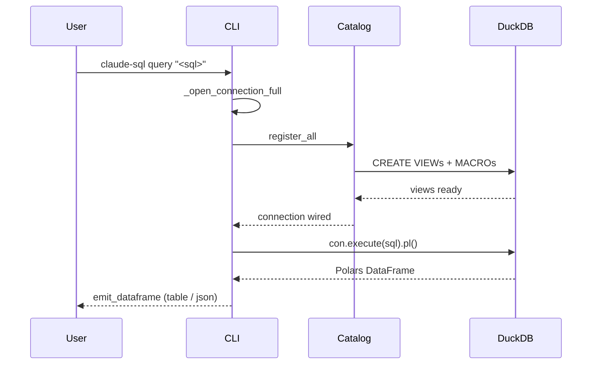
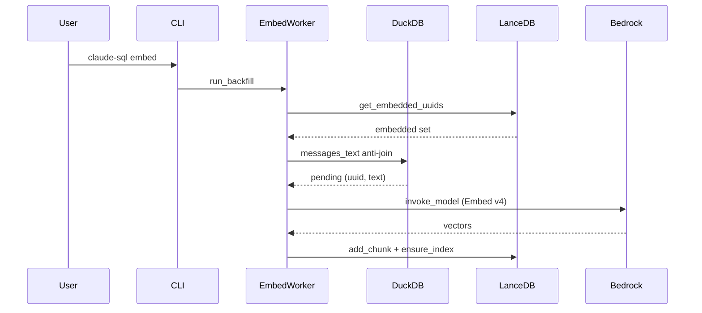
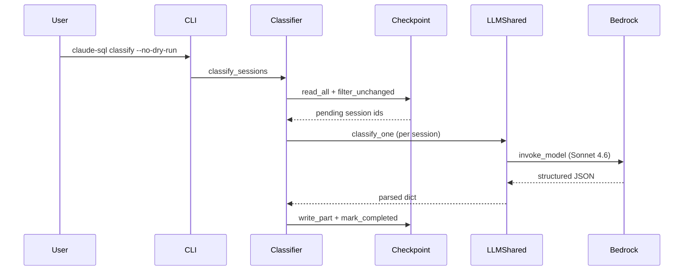

# claude-sql · Data flow

`claude-sql` is a single-process Cyclopts CLI: every flow starts when the user invokes a subcommand from a shell and ends when the binary exits (`packages/app/src/claude_sql/app/cli.py:3073`). There are no HTTP routes, queues, or scheduled jobs, so the three flows below are CLI subcommands chosen for load-bearing coverage: the read path (`query`), the async Bedrock write path (`embed`), and the canonical Sonnet LLM analytics pipeline (`classify`) whose shape the `trajectory`, `conflicts`, and `friction` workers replicate.

## Flow 1: claude-sql query <sql>

Read-only DuckDB execution against the registered view and macro catalog over the user's JSONL transcripts. No Bedrock, no LLM, no parquet writes.

1. User invokes `claude-sql query "<sql>"`; Cyclopts dispatches to the `query` command body (`packages/app/src/claude_sql/app/cli.py:728`).
2. `query` picks the connection mode: `_open_connection_full` when the SQL touches the catalog, `_open_connection_introspect` otherwise (`packages/app/src/claude_sql/app/cli.py:789`).
3. `_open_connection_full` opens an in-memory DuckDB, applies tuning PRAGMAs, and calls `register_all` (`packages/app/src/claude_sql/app/cli.py:360`).
4. `register_all` wires the catalog in dependency order: `register_raw` then `register_views` then `register_vss` then `register_analytics` then `register_macros` (`packages/core/src/claude_sql/core/sql_views.py:2078`).
5. `query` runs the user's SQL via `run_or_die(lambda: con.execute(sql).pl(), fmt=fmt)`, returning a Polars frame (`packages/app/src/claude_sql/app/cli.py:798`).
6. `run_or_die` returns the frame on success or routes a `duckdb.Error` through `classify_duckdb_error` to a parse/catalog/runtime exit code (`packages/core/src/claude_sql/core/output.py:228`).
7. On success, `emit_dataframe` renders the frame: a table on a TTY, JSON/NDJSON/CSV otherwise (`packages/app/src/claude_sql/app/cli.py:799`).
8. `query` closes the connection in its `finally` block and the process exits (`packages/app/src/claude_sql/app/cli.py:802`).

## Flow 2: claude-sql embed

Async fan-out over Cohere Embed v4 on Bedrock. Discovers unembedded messages by anti-joining LanceDB, embeds them in batches under a concurrency-limiting semaphore, writes vectors back to LanceDB, and ensures the HNSW index.

1. User invokes `claude-sql embed`; Cyclopts dispatches to the `embed` command body (`packages/app/src/claude_sql/app/cli.py:1559`).
2. `embed` opens a bare DuckDB connection and binds only `register_raw` and `register_views`, skipping VSS and analytics (`packages/app/src/claude_sql/app/cli.py:1609`).
3. `embed` calls `asyncio.run(run_backfill(...))` to drive the pipeline (`packages/app/src/claude_sql/app/cli.py:1616`).
4. `run_backfill` calls `discover_unembedded` to find the `(uuid, text)` pairs lacking an embedding (`packages/analytics/src/claude_sql/analytics/embed_worker.py:395`).
5. `discover_unembedded` reads embedded UUIDs via `lance_store.get_embedded_uuids` and anti-joins them against `messages_text` (`packages/analytics/src/claude_sql/analytics/embed_worker.py:144`).
6. `run_backfill` slices the pending list into chunks and calls `embed_documents_async`, which fans batches out under `asyncio.Semaphore(embed_concurrency)` (`packages/analytics/src/claude_sql/analytics/embed_worker.py:457`).
7. Each batch is dispatched via `_embed_one_batch` to `asyncio.to_thread(_invoke_bedrock_sync)`, which calls boto3 `invoke_model` against the Embed v4 profile (`packages/analytics/src/claude_sql/analytics/embed_worker.py:253`).
8. `run_backfill` writes each chunk into LanceDB via `lance_store.add_chunk`, then runs `optimize_if_needed` and `ensure_index` so later `search` calls hit a current index (`packages/analytics/src/claude_sql/analytics/embed_worker.py:485`).

## Flow 3: claude-sql classify

Sonnet 4.6 structured-output classification of full session transcripts. Anti-joins finished sessions against the parquet, skips unchanged sessions via the checkpoint, dispatches calls under an `anyio.CapacityLimiter`, parses the structured payload, writes a parquet shard per chunk, and stamps the checkpoint.

1. User invokes `claude-sql classify --no-dry-run`; Cyclopts dispatches to the `classify` command body (`packages/app/src/claude_sql/app/cli.py:1730`).
2. `classify` opens a full catalog connection and calls `classify_sessions` (`packages/app/src/claude_sql/app/cli.py:1782`).
3. `classify_sessions` enters the `pipeline_cache_stats("classify")` context and calls `asyncio.run(_classify_sessions_async)` (`packages/analytics/src/claude_sql/analytics/classify_worker.py:245`).
4. `_classify_sessions_async` reads existing shards via `read_all`, then computes the skip set via `session_bounds` and `checkpointer.filter_unchanged` (`packages/analytics/src/claude_sql/analytics/classify_worker.py:60`).
5. For each pending `(session_id, text)` from `iter_session_texts`, the worker schedules a `classify_one` coroutine under `anyio.CapacityLimiter(llm_concurrency)` (`packages/analytics/src/claude_sql/analytics/classify_worker.py:106`).
6. `classify_one` hands the blocking call to `anyio.to_thread.run_sync(_invoke_classifier_sync)`, which calls Bedrock `invoke_model` with `output_config.format` and parses the structured payload (`packages/core/src/claude_sql/core/llm_shared.py:585`).
7. After each chunk, ok rows are written via `write_part` to a fresh `<cache>/part-<ts_ns>.parquet` shard (`packages/analytics/src/claude_sql/analytics/classify_worker.py:162`).
8. The worker stamps `checkpointer.mark_completed` for the written sessions so the next run skips them unless the JSONL mtime moves (`packages/analytics/src/claude_sql/analytics/classify_worker.py:169`).

## See also

- [claude-sql · Contract map](../insights/contract-map.md) — 6 shared source files
- [claude-sql · Debugging guide](../insights/debugging-guide.md) — 5 shared source files
- [claude-sql · Public API](../reference/public-api.md) — 5 shared source files
- [claude-sql · Module map](module-map.md) — 4 shared source files
- [claude-sql · Processes](../behavior/processes.md) — 4 shared source files
