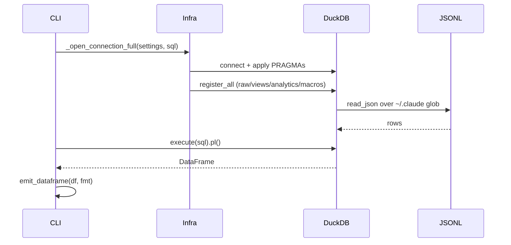
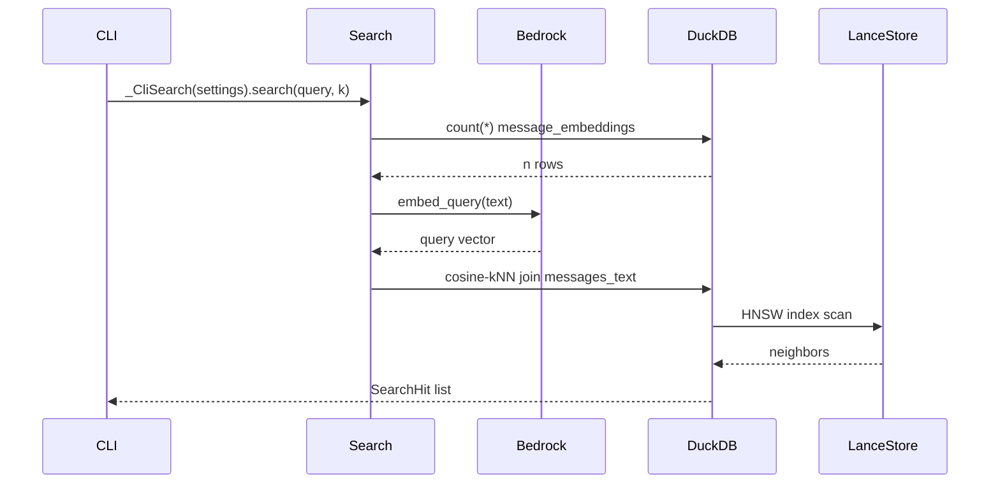
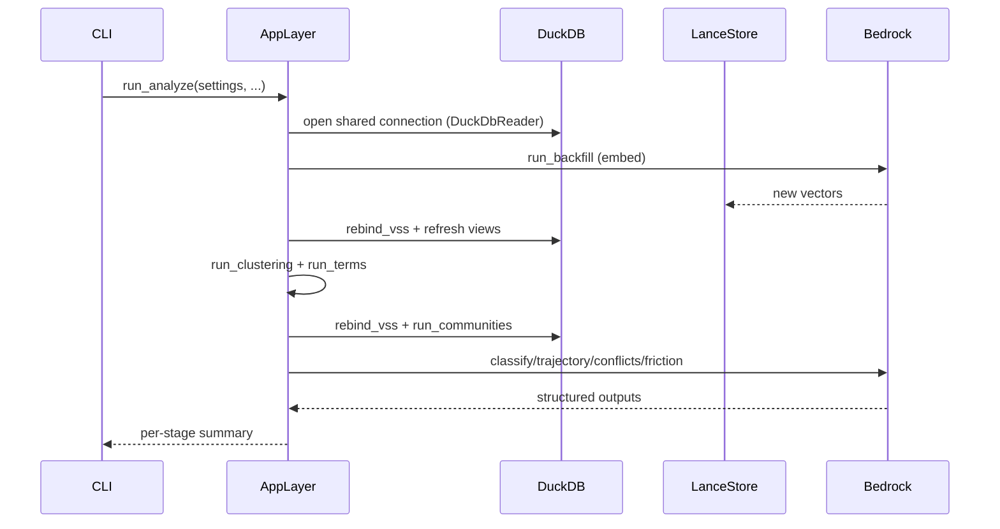

# claude-sql · Data flow

`claude-sql` is a CLI, not a service: every process is a cyclopts subcommand
dispatched through `src/claude_sql/interfaces/cli/app.py`. The three flows below
are the load-bearing ones — the read-only SQL path (`query`), the semantic
search path (`search`), and the composite `analyze` pipeline that chains every
analytics stage through one shared, re-bound DuckDB connection. Participant
labels use the POST-reshape hexagonal layer names (`CLI` = interfaces, `AppLayer`
= application, `Infra` = infrastructure) since the module-map is mid-rewrite.

## Flow 1: query (read-only SQL over the catalog)

1. `query` receives one SQL string and configures logging + settings + output format `src/claude_sql/interfaces/cli/app.py:541`.
2. It routes the connection: `_sql_uses_catalog` substring-matches view/macro names to decide full vs. introspect-only registration `src/claude_sql/interfaces/cli/app.py:602`.
3. On the catalog path it opens an in-memory connection, migrating legacy caches, applying PRAGMAs, and gating VSS by `sql_uses_vss` `src/claude_sql/infrastructure/duckdb_connection.py:149`.
4. `register_all` wires raw views, derived views, optional VSS, analytics views, and macros in dependency order `src/claude_sql/infrastructure/duckdb_views.py:2285`.
5. `register_raw` binds `read_json` over the JSONL glob so DuckDB reads `~/.claude/**/*.jsonl` in place, zero-copy `src/claude_sql/infrastructure/duckdb_views.py:2332`.
6. The statement executes against the registered catalog and materializes to a polars DataFrame `src/claude_sql/interfaces/cli/app.py:611`.
7. `emit_dataframe` renders a table on TTY or JSON on pipe, then the connection closes in the `finally` `src/claude_sql/interfaces/cli/app.py:612`.

## Flow 2: search (semantic top-k via HNSW)

1. `search` treats `query_text` as a natural-language query and applies any `--embedding-provider` override `src/claude_sql/interfaces/cli/app.py:1389`.
2. It builds a `_CliSearch` subclass of `DuckDbSessionSearch` whose `embed_query` routes through the embed use case for monkeypatch parity `src/claude_sql/interfaces/cli/app.py:1464`.
3. `DuckDbSessionSearch.search` opens a minimally-registered connection and guards on `SELECT count(*) FROM message_embeddings` — empty store returns no hits `src/claude_sql/infrastructure/session_search.py:129`.
4. `embed_query` calls the injected `EmbeddingProvider` (Cohere Embed v4 on Bedrock by default) to embed the query text `src/claude_sql/infrastructure/session_search.py:142`.
5. The cosine-kNN SQL joins `message_embeddings` to `messages_text`, ranking by `array_cosine_distance` ASC to trigger the HNSW index scan `src/claude_sql/infrastructure/session_search.py:160`.
6. Rows become typed `SearchHit` objects carrying uuid, session_id, role, snippet, and cosine similarity `src/claude_sql/infrastructure/session_search.py:175`.
7. The command projects hits into a DataFrame and emits it; an empty result exits with code 2 and a re-embed hint `src/claude_sql/interfaces/cli/app.py:1477`.

## Flow 3: analyze (composite pipeline with register-write-rebind)

1. `analyze` applies embedding + LLM-analytics provider overrides, then delegates to the application layer with the CLI's own lifecycle seams for monkeypatch parity `src/claude_sql/interfaces/cli/app.py:2077`.
2. `run_analyze` syncs the skills catalog, opens ONE shared connection, and wraps it in a `DuckDbReader` that exposes the rebind lifecycle `src/claude_sql/application/analyze.py:187`.
3. The ingest stage stamps tiktoken counts + blake2b SimHash and resolves canonicals, refreshing analytics views around the resolve `src/claude_sql/application/analyze.py:195`.
4. `run_backfill` embeds new messages into LanceDB, after which `rebind_vss("embed")` re-binds `message_embeddings` against the mutated Lance namespace `src/claude_sql/application/analyze.py:223`.
5. `run_clustering` (UMAP+HDBSCAN) rewrites `clusters.parquet` and `run_terms` derives c-TF-IDF labels; analytics views refresh so cluster IDs become visible `src/claude_sql/application/analyze.py:228`.
6. Before community detection, VSS re-binds and analytics refresh again — RFC §9.6's named stale-connection fix — then `run_communities` runs Leiden+CPM `src/claude_sql/application/analyze.py:251`.
7. The four LLM stages (`classify_sessions`, `trajectory_messages`, `detect_conflicts`, `detect_user_friction`) run in order, each refreshing views afterward `src/claude_sql/application/analyze.py:262`.
8. The shared connection closes in the `finally` and a per-stage summary dict returns `src/claude_sql/application/analyze.py:314`.

## See also

- [claude-sql · Processes](../behavior/processes.md) — 5 shared source citations
- [claude-sql · Sequences](../diagrams/behavioral/sequences.md) — 4 shared source citations
- [claude-sql · Module map](../architecture/module-map.md) — 3 shared source citations
- [claude-sql · Debugging guide](../insights/debugging-guide.md) — 3 shared source citations
- [claude-sql · Impact analysis](../insights/impact-analysis.md) — 3 shared source citations
