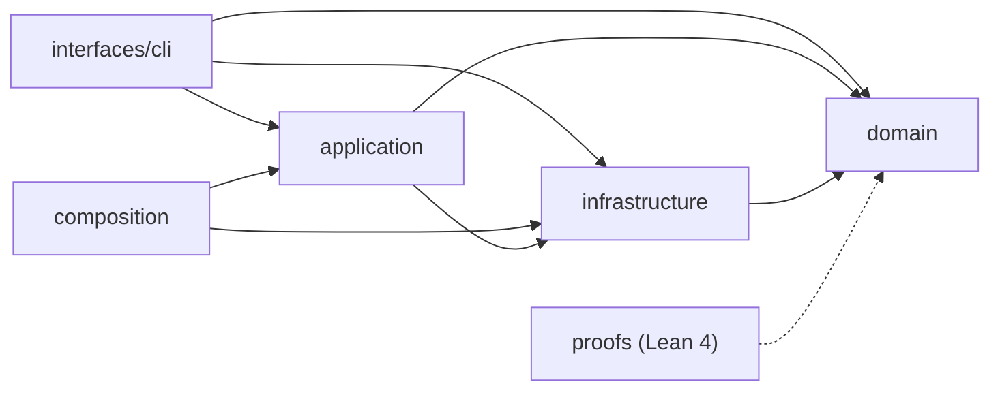

# claude-sql · System overview

`claude-sql` is a standalone Python CLI that makes a developer's own Claude Code
transcripts — the JSONL files under `~/.claude/projects/**` plus subagent
sidecars — queryable in place with zero copy (`pyproject.toml:4`). It stacks
four analytics layers over those files: SQL views and macros through DuckDB,
semantic search over message embeddings, LLM-driven session classification, and
structural clustering into topics and communities. The intended reader is the
transcript owner, or an agent acting on their behalf: every subcommand emits
machine-readable output, so a calling LLM can do progressive disclosure into the
corpus before reading raw transcripts. The single console script is
`claude-sql`, bound to `claude_sql.interfaces.cli.app:main` (`pyproject.toml:53`,
`interfaces/cli/app.py:2115`).

The codebase is a strict hexagon. The import-linter contract declares one layered
DAG — `interfaces` > `application` > `infrastructure` > `domain`
(`pyproject.toml:298-303`) — and grep confirms it holds: `domain` imports no
other layer, while `infrastructure` reaches down into `domain` across 13 files
and `application` reaches into both `infrastructure` (11 files) and `domain`
(9 files). **`domain/`** is the pure core (17 files, 2429 LOC): the pydantic
models (`domain/models.py:1`, 398 LOC), the error taxonomy
(`domain/errors.py:1`), the transcript-assembly and turn-rendering logic
(`domain/transcript.py:1`, 343 LOC), the dedup, trajectory, friction, and cost
math, and the heavy-compute `structure/` package (cluster, community, terms). It
also holds the two provider ports as `@runtime_checkable` Protocols —
`EmbeddingProvider` and `LlmAnalyticsProvider` (`domain/ports.py:34`,
`domain/ports.py:79`).

**`application/`** (17 files, 5516 LOC) holds the port Protocols the
infrastructure adapters satisfy — 8 of them, including `TranscriptReaderPort`,
`SessionSearchPort`, and `VectorStorePort` (`application/ports.py:64-249`) — plus
one use-case module per subcommand (embed, classify, trajectory, conflicts,
friction, ingest, cluster, terms, community, skills, peek) and the multi-stage
`run_analyze` pipeline that chains them with a VSS-then-analytics rebind
(`application/analyze.py:99`). **`infrastructure/`** (28 files, 7927 LOC) is the
adapter layer: the DuckDB engine and all view/macro DDL — 25 views and 26 macros
registered by `register_all` (`infrastructure/duckdb_views.py:2285`) — the
LanceDB vector store, the Bedrock and pluggable embedding clients, the SQLite
checkpoint/retry state, parquet caches, and the env-driven `Settings`
(`infrastructure/settings.py:1`, 544 LOC). **`interfaces/cli/`** (5 files) is the
thin cyclopts CLI plus output formatting (`interfaces/cli/app.py:1`, 2121 LOC).

Two modules stand outside the four-layer stack. `composition.py` is the
importable composition root — the `ClaudeSql` facade and `build_*` factories that
wire adapters lazily for sibling projects (`composition.py:36`). And `proofs/` is
a Lean 4 layer that machine-checks pure domain invariants (backoff, Hamming,
turn-sort), wired into the quality gate as `mise run proofs` (`mise.toml:126`).

A typical read flow: the CLI opens an in-memory DuckDB connection, calls
`register_all` to bind every view, macro, and the Lance-backed VSS index, then
runs the user's SQL and formats the result. Expensive outputs — embeddings,
classifications, clusters — are cached as parquet under `~/.claude/`, so reruns
on untouched sessions are free. To orient in the code, open
`interfaces/cli/app.py` for the command surface, `application/analyze.py` for the
pipeline, and `infrastructure/duckdb_views.py` for the SQL schema.

## Stack

| Layer | Technology | Source |
|---|---|---|
| Language | Python `>=3.13` | `pyproject.toml:8` |
| CLI framework | cyclopts `>=4.10.2` | `pyproject.toml:31` |
| Query engine | DuckDB `>=1.5.2,<2` | `pyproject.toml:32` |
| Vector store | LanceDB `>=0.30,<0.35` | `pyproject.toml:35` |
| Data frames | polars `>=1.40.0` | `pyproject.toml:40` |
| Clustering | umap-learn + hdbscan + leidenalg | `pyproject.toml:49` |
| Models/config | pydantic + pydantic-settings | `pyproject.toml:42` |
| Build backend | uv_build `>=0.11.14,<0.12` | `pyproject.toml:73` |

## Module map

## See also

- [claude-sql · Business logic](../insights/business-logic.md) — 6 shared source citations
- [claude-sql · Tech debt](../insights/tech-debt.md) — 3 shared source citations
