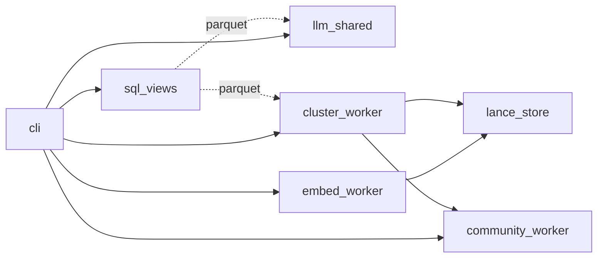

# claude-sql · System overview

`claude-sql` is a single-user Python CLI that makes Claude Code transcripts —
the JSONL files Claude Code writes under `~/.claude/projects/*/*.jsonl` plus
their subagent sidecars — queryable in place, with zero copy
(`pyproject.toml:3`). It targets developers who use Claude Code daily and
want to ask things like "which sessions cost me the most this month" or
"find every conversation where I argued with myself" without exporting,
ETL'ing, or warehousing the corpus. The package ships one console script,
`claude-sql`, wired to `claude_sql.cli:main` via Cyclopts
(`pyproject.toml:56`). On Python 3.13+ (`pyproject.toml:10`) the CLI binds
DuckDB directly to the on-disk JSONLs through `read_json(..., filename=true,
union_by_name=true)`, layers 18 normalized views and 14 macros on top
(`src/claude_sql/sql_views.py:62`), and adds three optional analytics tiers:
Cohere Embed v4 vectors stored in a local LanceDB dataset for semantic
search; Sonnet 4.6 structured-output classifiers for autonomy tier, work
category, sentiment trajectory, stance conflicts, and short-message
friction signals; and UMAP+HDBSCAN clusters plus Leiden+CPM communities
over session centroids. Every expensive output is cached to parquet under
`~/.claude/`, and every spend command defaults to `--dry-run`.

The codebase is a single flat package at `src/claude_sql/`. The CLI module
(`src/claude_sql/cli.py:1`, 2917 LOC) is the only place that knows about
every other module — Cyclopts subcommands import workers lazily so the
fast read-only path stays cheap. The SQL backbone is `sql_views.py:1`
(2228 LOC), which builds the view + macro registry and is the only module
that wires DuckDB to the JSONL corpus; it depends on `config.py` and
`parquet_shards.py` and on nothing else in the package, keeping the SQL
layer independent of the LLM stack. The LLM stack is centred on
`llm_shared.py:1` (1341 LOC), which owns the Bedrock client, the
structured-output dispatcher, the per-pipeline cache-stat accumulator,
and the four task-framing system prompts. The four classifier workers —
`classify_worker.py`, `trajectory_worker.py`, `conflicts_worker.py`,
`friction_worker.py` — share this module and never import each other.
The vector path is `embed_worker.py:1` (533 LOC) writing into
`lance_store.py:1` (261 LOC), which holds the FLOAT[1024] vectors plus
the IVF_HNSW_SQ index in one versioned LanceDB directory and is read
back through DuckDB's `lance` core extension. `cluster_worker.py:1`
reads the same Lance table for UMAP+HDBSCAN; `community_worker.py:1`
(667 LOC) reads message embeddings, builds session centroids, and runs
`leidenalg.find_partition` with `CPMVertexPartition`. Configuration is
pydantic-settings driven — every knob is `CLAUDE_SQL_*`-prefixed
(`src/claude_sql/config.py:1`).

A first-time reader should open four files in this order. `cli.py` enumerates
the subcommand surface and is the map of what the tool can do
(`src/claude_sql/cli.py:1`). `sql_views.py` declares the 18 views and 14
macros that define the queryable shape of the corpus
(`src/claude_sql/sql_views.py:62`); the view set is the public schema even
when callers go through DuckDB directly. `llm_shared.py` documents the
Bedrock retry policy, structured-output schemas, and per-pipeline cache
accounting that govern every classifier (`src/claude_sql/llm_shared.py:1`).
`config.py` lists every environment-variable knob and its default
(`src/claude_sql/config.py:1`). A typical request lifecycle is short: the
CLI parses flags, opens a DuckDB connection, calls `register_all` from
`sql_views.py` to bind raw + business + analytics views, then either runs
the user's SQL (read-only path) or invokes a worker that streams sessions
to Bedrock and appends parquet shards to `~/.claude/` (write path). The
analytics-output parquets are themselves bound back as DuckDB views on the
next connection, so once a session has been classified or embedded the
result is queryable through the same SQL surface as the raw transcript.

## Stack

| Layer | Technology | Source |
| --- | --- | --- |
| Language | Python 3.13+ | `pyproject.toml:10` |
| CLI framework | Cyclopts | `pyproject.toml:33` |
| Embedded SQL engine | DuckDB 1.5.2 | `pyproject.toml:35` |
| Vector store | LanceDB (with IVF_HNSW_SQ index) | `pyproject.toml:38` |
| LLM + embeddings | Amazon Bedrock via boto3 | `pyproject.toml:32` |
| DataFrame + schema | polars + pydantic | `pyproject.toml:43` |
| Clustering + communities | hdbscan, umap-learn, leidenalg | `pyproject.toml:36` |

## Module map

## See also

- [claude-sql · Risk hotspots](../analysis/risk-hotspots.md) — 4 shared citations
- [claude-sql · Module map](../architecture/module-map.md) — 3 shared citations
- [claude-sql · Tech debt](../insights/tech-debt.md) — 2 shared citations
