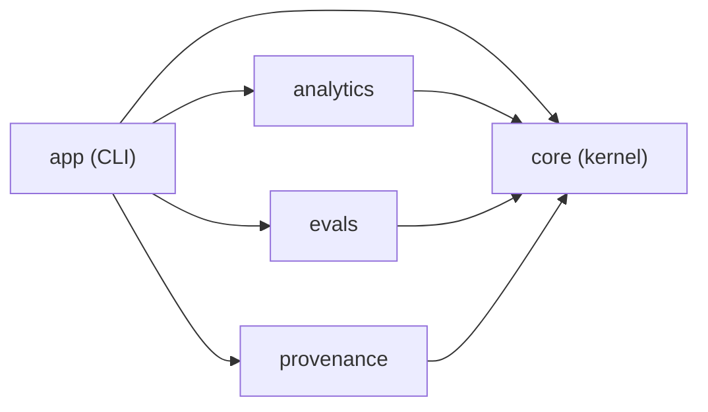

# claude-sql · System overview

`claude-sql` turns Claude Code session transcripts into a queryable, self-improving record of work. The JSONL files Claude Code writes under `~/.claude/projects/` are read in place — zero copy, no export pipeline — and exposed as DuckDB views, so a user can ask "which Opus sessions cost more than $5 this month?" or "group my sessions by theme" and get an answer in under a second (`README.md:11`, `README.md:61`). The audience is any Claude Code user who wants to remember past work, see where time and money go, and notice patterns in how they collaborate with the agent. It ships as a single `claude-sql` CLI binary declared at `packages/app/pyproject.toml:37` (`claude-sql = "claude_sql.app.cli:main"`), installable as an isolated uv tool (`README.md:97`).

Beyond raw SQL, the tool layers in semantic search over Cohere Embed v4 embeddings, Sonnet 4.6 LLM classification (session autonomy, work category, success, friction), clustering, and Leiden community detection — each materialized to cached, sharded parquet that rebuilds only on explicit re-run (`README.md:88`). It also binds transcripts to pull requests via git commit trailers and notes (`packages/provenance/pyproject.toml:4`).

The codebase is a uv workspace whose root is a virtual conductor with no runtime dependencies; the five members under `packages/*` own those (`pyproject.toml:10`, `pyproject.toml:39`). The modules form a strict layered DAG enforced by import-linter: `core` (L0) below the three siblings (L1) below `app` (L2), with the siblings declared mutually independent (`pyproject.toml:246`, `pyproject.toml:255`).

`core` is the kernel and the largest module (13 files, 6434 LOC): settings, DuckDB view registration, Bedrock LLM primitives, logging, output formatting, parquet shard helpers, and Pydantic schemas (`packages/core/pyproject.toml:4`). Its `sql_views.py` (2182 LOC) registers every business view and macro (`packages/core/src/claude_sql/core/sql_views.py:1`); `llm_shared.py` (1341 LOC) holds the shared Bedrock structured-output path (`packages/core/src/claude_sql/core/llm_shared.py:1`).

`analytics` (11 files, 4756 LOC) is the heaviest L1 sibling — embed, classify, trajectory, conflicts, friction, cluster, terms, community, and ingest workers (`packages/analytics/pyproject.toml:4`). Its `trajectory_worker.py` runs 1005 LOC (`packages/analytics/src/claude_sql/analytics/trajectory_worker.py:1`). `evals` (7 files, 1493 LOC) is the eval gym: cross-lineage Bedrock judge panels with pre-registered manifests and a kappa floor (`packages/evals/pyproject.toml:4`). `provenance` (4 files, 1376 LOC) handles transcript-to-PR binding and single-shot PR review sheets (`packages/provenance/pyproject.toml:4`).

`app` (3 files, 3158 LOC) is the top layer: a single cyclopts CLI whose `cli.py` is the largest file in the repository at 3079 LOC and imports from all four lower modules (`packages/app/src/claude_sql/app/cli.py:45`). The three L1 siblings are mutually independent — each imports only `core` — and `app` composes them into subcommands such as `query`, `embed`, `search`, `classify`, `cluster`, `community`, and `analyze` (`README.md:216`).

## Stack

| Layer | Technology | Source |
| --- | --- | --- |
| Language | Python `>=3.13` | `pyproject.toml:8` |
| Query engine | DuckDB `>=1.5.2,<2` | `packages/core/pyproject.toml:12` |
| Vector store | LanceDB `>=0.30,<0.31` | `packages/core/pyproject.toml:13` |
| Dataframes | Polars `>=1.40.0` | `packages/core/pyproject.toml:15` |
| LLM / embeddings | boto3 (Bedrock) + anthropic | `packages/core/pyproject.toml:11` |
| CLI framework | cyclopts `>=4.10.2` | `packages/app/pyproject.toml:32` |
| Clustering | umap-learn, hdbscan, leidenalg | `packages/analytics/pyproject.toml:12` |
| Build / packaging | uv workspace + `uv_build` | `pyproject.toml:39` |
| Lint / typecheck | ruff + ty | `pyproject.toml:65` |
| Test | pytest via mise task | `mise.toml:127` |

## Module map

## See also

- [claude-sql · Tech debt](../insights/tech-debt.md) — 6 shared source files
- [claude-sql · Contract map](../insights/contract-map.md) — 5 shared source files
- [claude-sql · Debugging guide](../insights/debugging-guide.md) — 5 shared source files
- [claude-sql · Impact analysis](../insights/impact-analysis.md) — 4 shared source files
- [claude-sql · Module map](module-map.md) — 4 shared source files
