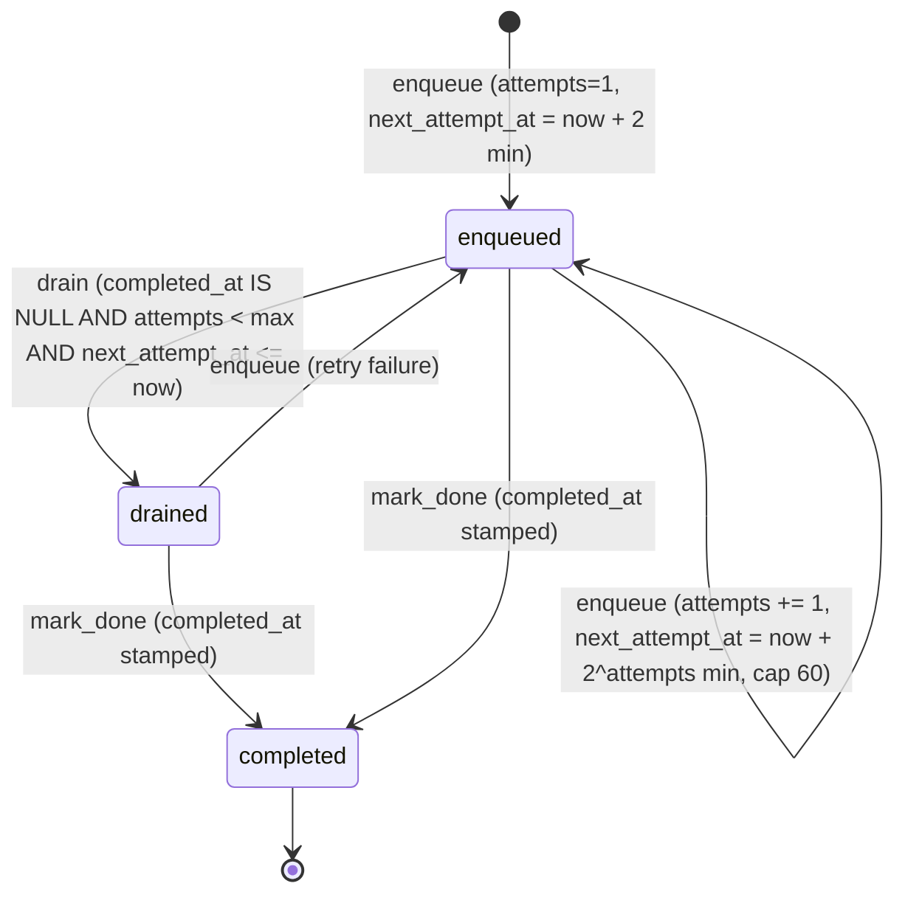
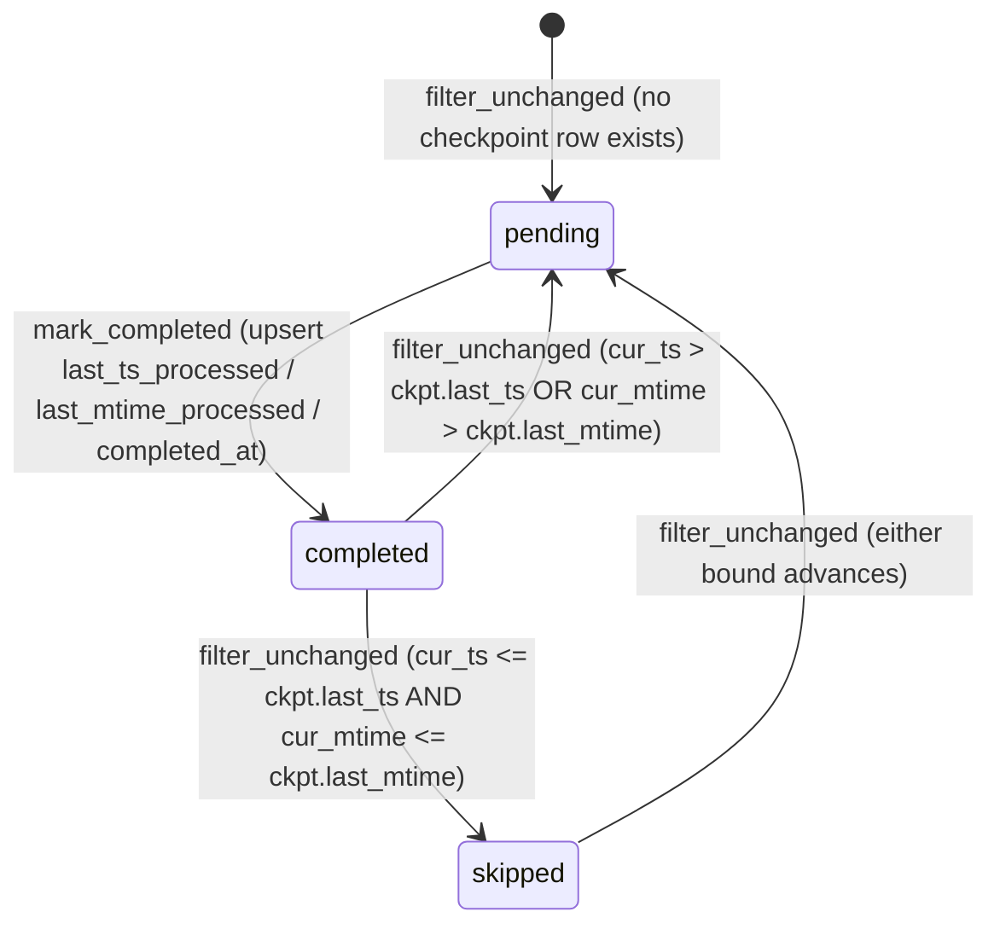
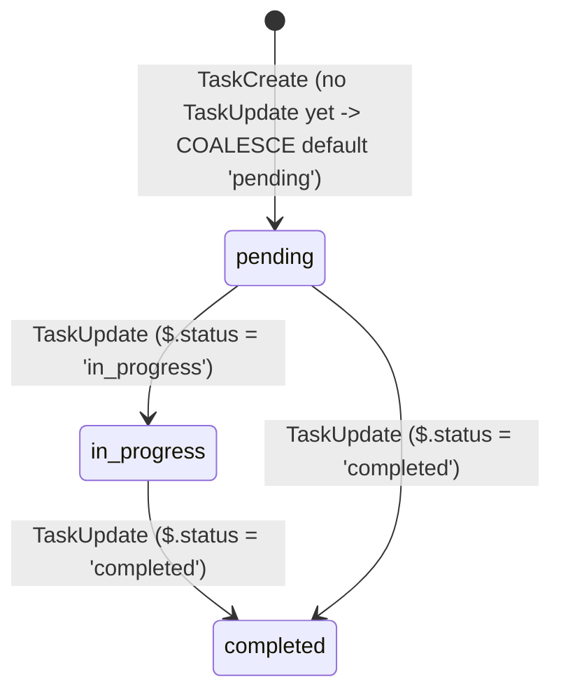
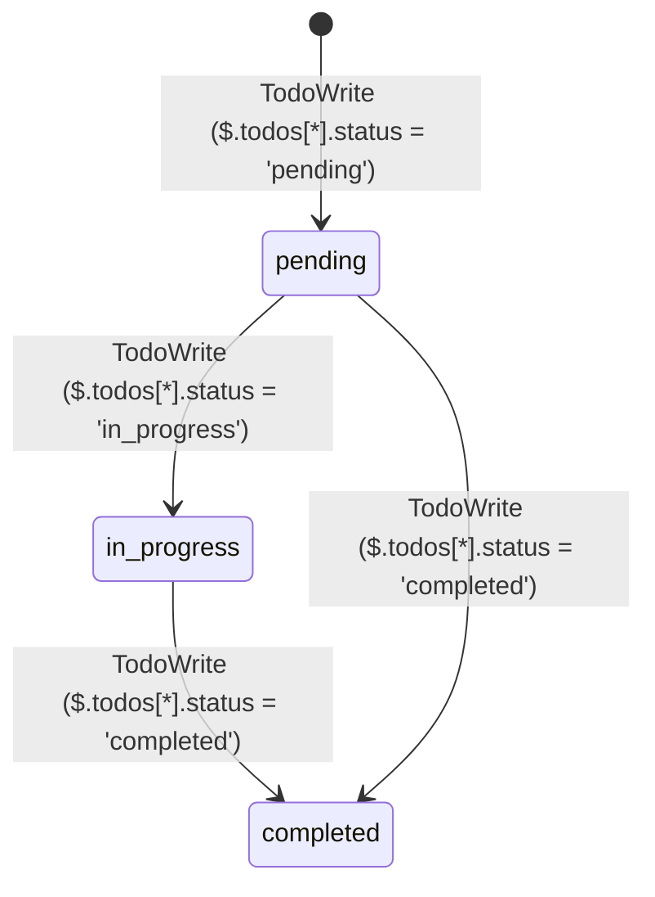

# claude-sql · State machines

## retry-queue

One row per `(pipeline, unit_id)` in the SQLite `retry_queue` table. A first failure inserts with `attempts=1`; a repeat failure upserts with `attempts += 1` and an exponential backoff `next_attempt_at` (`retry_queue.py:9-16`). `enqueue` performs the insert-or-increment upsert (`retry_queue.py:85-128`); backoff minutes are `min(2**attempts, 60)` (`retry_queue.py:79-82`). `drain` returns rows where `completed_at IS NULL AND attempts < max AND next_attempt_at <= now` (`retry_queue.py:145-150`). `mark_done` stamps `completed_at` only while it is still NULL (`retry_queue.py:177-178`); the completed row stays as an audit trail (`retry_queue.py:15`).

Defined at: `src/claude_sql/core/retry_queue.py:85-184`

## session-checkpoint

One row per `(session_id, pipeline)` in the SQLite `session_checkpoint` table. `filter_unchanged` routes a candidate session to `pending` when no checkpoint row exists, and to `skipped` only when both `current_last_ts <= ckpt.last_ts` and `current_last_mtime <= ckpt.last_mtime`; either bound advancing re-routes it to `pending` (`checkpointer.py:285-313`). The staleness comparison is `_stale_or_equal`, which returns False (advance) when either side is None (`checkpointer.py:316-326`). `mark_completed` upserts the row with the processed timestamps and stamps `completed_at` (`checkpointer.py:329-366`).

Defined at: `src/claude_sql/core/checkpointer.py:285-366`

## tasks_state_current

Latest status per `(session_id, task_id)`, joining `task_creations` to the most-recent `task_updates` row (`sql_views.py:921-971`). The entry state is `pending`: when no `TaskUpdate` exists, the status `COALESCE`s to the literal `'pending'` (`sql_views.py:961`). Transitions are driven by the `TaskUpdate` / `mcp__tasks__task_update` tool writing `$.status` (`sql_views.py:894-914`); the latest `updated_at` wins (`sql_views.py:947-955`). The status values `in_progress` and `completed` are confirmed verbatim in the fixture `TaskUpdate` calls (`tests/test_sql_views.py:257`, `tests/test_sql_views.py:272`). Source defines no terminal `deleted` state for this view, so none is drawn.

Defined at: `src/claude_sql/core/sql_views.py:921-971`

## todo_state_current

Latest status per `(session_id, subject)`, taking the most-recent `TodoWrite` snapshot (`sql_views.py:830-845`). Each `TodoWrite` snapshot writes a `status` per todo via `json_extract_string(todo, '$.status')` (`sql_views.py:809-828`); the highest `snapshot_ix` wins (`sql_views.py:836-842`). The status values `pending`, `in_progress`, and `completed` are confirmed verbatim in the fixture `TodoWrite` calls (`tests/test_sql_views.py:120`, `tests/test_sql_views.py:159`, `tests/test_sql_views.py:154`). Source defines no terminal `deleted` state for this view, so none is drawn.

Defined at: `src/claude_sql/core/sql_views.py:830-845`

## See also

- [claude-sql · Debugging guide](../insights/debugging-guide.md) — 3 shared source files
- [claude-sql · Impact analysis](../insights/impact-analysis.md) — 3 shared source files
- [claude-sql · Risk hotspots](../analysis/risk-hotspots.md) — 3 shared source files
- [claude-sql · Business logic](../insights/business-logic.md) — 2 shared source files
- [claude-sql · Contract map](../insights/contract-map.md) — 2 shared source files
