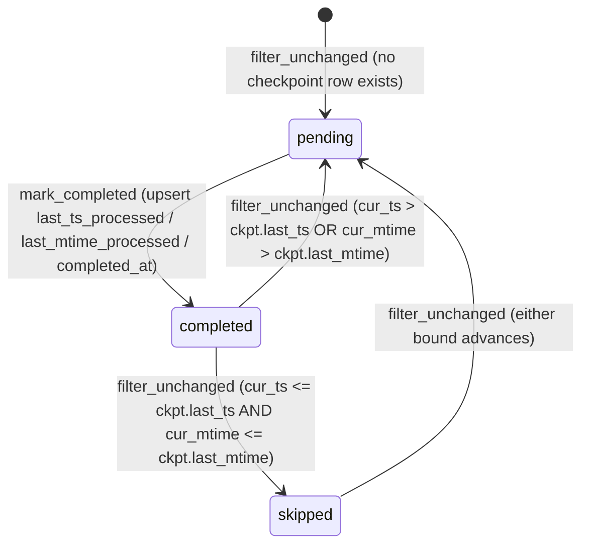
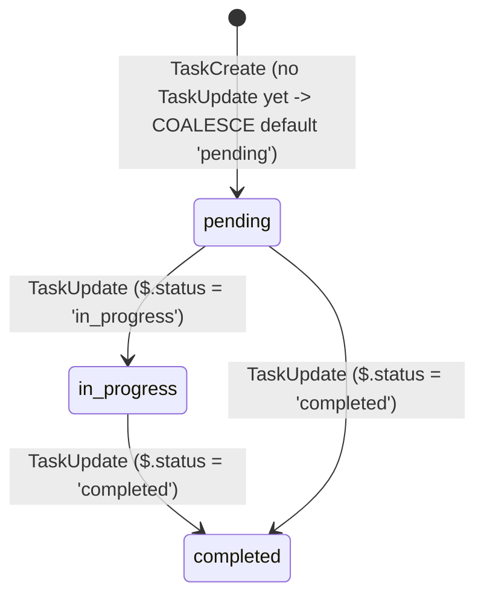
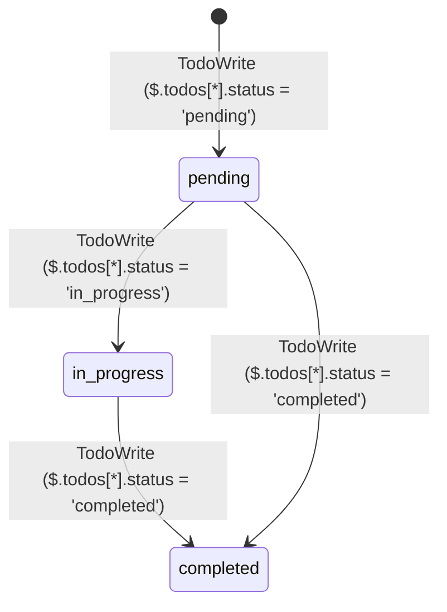

# claude-sql · State machines

`claude-sql` declares no state-machine library (no XState/Stateful equivalent). The four machines below are of two kinds: two durable-worker row lifecycles in the shared `~/.claude/state.db` SQLite WAL file (`retry_queue`, `session_checkpoint`), where an entity's state lives in its row's columns and transitions are the named functions that mutate them; and two transcript-derived DuckDB view lifecycles (`tasks_state_current`, `todo_state_current`), where each state is a `status` value a Claude Code tool wrote into the JSONL and the "transition" is the next `TaskUpdate` / `TodoWrite` snapshot superseding the prior one.

The `Literal[...]` unions in `src/claude_sql/domain/models.py` (`autonomy_tier` at `src/claude_sql/domain/models.py:34`, `success` at `:65`, `transition_kind` at `:158`, `conflict_kind` at `:244`, `severity` at `:257`, friction `label` at `:340`) are classification taxonomies — fixed label sets a model assigns to one row, not transition-driven state — and are excluded.

## retry_queue

One row per `(pipeline, unit_id)` records a retryable Bedrock failure. State is carried by the `attempts`, `completed_at`, and `next_attempt_at` columns; there is no `status` field. `enqueue` inserts a first failure with `attempts=1` or increments a repeat failure (and re-nulls `completed_at`), `mark_done` stamps `completed_at`, and `drain` returns only rows still eligible under the guard `completed_at IS NULL AND attempts < max AND next_attempt_at <= now`.

```mermaid
stateDiagram-v2
    [*] --> enqueued : enqueue (attempts=1, next_attempt_at = now + 2 min)
    enqueued --> enqueued : enqueue (attempts += 1, next_attempt_at = now + 2^attempts min, cap 60)
    enqueued --> drained : drain (completed_at IS NULL AND attempts < max AND next_attempt_at <= now)
    drained --> enqueued : enqueue (retry failure)
    drained --> completed : mark_done (completed_at stamped)
    enqueued --> exhausted : attempts >= max_attempts
    completed --> enqueued : enqueue (reopens; completed_at re-set to NULL)
```

- `enqueue` insert-or-increment upsert at `src/claude_sql/infrastructure/sqlite_state/retry_queue.py:85`; backoff minutes are `min(2**attempts, 60)` (`src/claude_sql/infrastructure/sqlite_state/retry_queue.py:81`). The ON CONFLICT clause re-sets `completed_at = NULL` (`src/claude_sql/infrastructure/sqlite_state/retry_queue.py:122`), so `enqueue` on a `completed` row reopens it.
- `drain` eligibility predicate at `src/claude_sql/infrastructure/sqlite_state/retry_queue.py:147`; `mark_done` stamps `completed_at` only while still NULL at `src/claude_sql/infrastructure/sqlite_state/retry_queue.py:177`.
- `exhausted` = `completed_at IS NULL AND attempts >= max_attempts` (`MAX_ATTEMPTS_DEFAULT = 5`, `src/claude_sql/infrastructure/sqlite_state/retry_queue.py:38`); such rows fail the `attempts < ?` predicate in `drain` and are never returned. No `[*]` terminal is drawn — a `completed` row persists as an audit trail (`src/claude_sql/infrastructure/sqlite_state/retry_queue.py:15`).

Defined at: `src/claude_sql/infrastructure/sqlite_state/retry_queue.py:41`

## session_checkpoint

One row per `(session_id, pipeline)` records the `(last_ts_processed, last_mtime_processed)` high-water mark for an LLM pipeline, so re-runs skip sessions whose transcripts have not advanced. `filter_unchanged` routes each candidate session to reprocess-or-skip; `mark_completed` upserts the high-water row after processing.



- `filter_unchanged` routes to `pending` when no checkpoint row exists (`src/claude_sql/infrastructure/sqlite_state/checkpointer.py:306`), and to `skipped` only when both `current_last_ts <= ckpt.last_ts` and `current_last_mtime <= ckpt.last_mtime`; either bound advancing re-routes to `pending` (`src/claude_sql/infrastructure/sqlite_state/checkpointer.py:310`).
- The staleness comparison is `_stale_or_equal`, which returns False (advance) when either side is None (`src/claude_sql/infrastructure/sqlite_state/checkpointer.py:317`).
- `mark_completed` upserts the row with the processed timestamps and stamps `completed_at` (`src/claude_sql/infrastructure/sqlite_state/checkpointer.py:330`). No `[*]` terminal is drawn — a `completed` row is the skip baseline for the next run.

Defined at: `src/claude_sql/infrastructure/sqlite_state/checkpointer.py:44`

## tasks_state_current

Latest status per `(session_id, task_id)`, joining `task_creations` to the most-recent `task_updates` row (`src/claude_sql/infrastructure/duckdb_views.py:949`). The entry state is `pending`: when no `TaskUpdate` exists, the status `COALESCE`s to the literal `'pending'` (`src/claude_sql/infrastructure/duckdb_views.py:987`). Transitions are driven by a `TaskUpdate` / `mcp__tasks__task_update` tool call writing `$.status` (`src/claude_sql/infrastructure/duckdb_views.py:933`); the latest `updated_at` wins (`src/claude_sql/infrastructure/duckdb_views.py:975-978`).



The status values `in_progress` and `completed` are confirmed verbatim in the fixture `TaskUpdate` calls (`tests/test_sql_views.py:258`, `tests/test_sql_views.py:273`), and the resulting current state at `tests/test_sql_views.py:467`. Source defines no terminal `deleted` state for this view, so none is drawn.

Defined at: `src/claude_sql/infrastructure/duckdb_views.py:949`

## todo_state_current

Latest status per `(session_id, subject)`, taking the most-recent `TodoWrite` snapshot (`src/claude_sql/infrastructure/duckdb_views.py:858`). Each `TodoWrite` snapshot writes a `status` per todo via `json_extract_string(todo, '$.status')` (`src/claude_sql/infrastructure/duckdb_views.py:843`); the highest `snapshot_ix` wins (`src/claude_sql/infrastructure/duckdb_views.py:862-865`).



The status values `pending`, `in_progress`, and `completed` are confirmed verbatim in the fixture `TodoWrite` calls (`tests/test_sql_views.py:121`, `tests/test_sql_views.py:160`, `tests/test_sql_views.py:155`). Source defines no terminal `deleted` state for this view, so none is drawn.

Defined at: `src/claude_sql/infrastructure/duckdb_views.py:858`

## See also

- [claude-sql · Contract map](../insights/contract-map.md) — 4 shared source citations
- [claude-sql · Module map](../architecture/module-map.md) — 2 shared source citations
- [claude-sql · Debugging guide](../insights/debugging-guide.md) — 2 shared source citations
- [claude-sql · Impact analysis](../insights/impact-analysis.md) — 2 shared source citations
