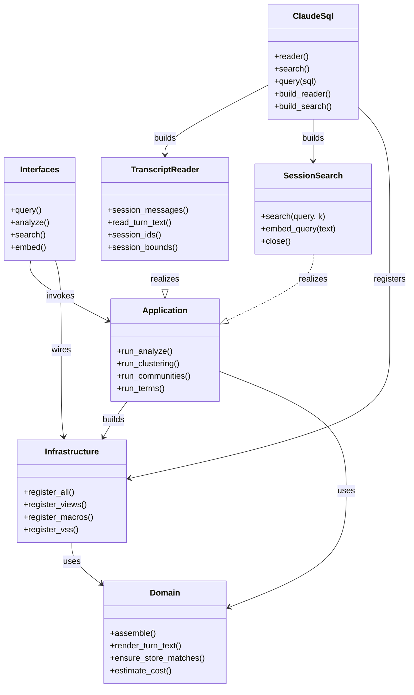

# claude-sql · Components

```mermaid
classDiagram
    class ClaudeSql {
        +reader()
        +search()
        +query(sql)
        +build_reader()
        +build_search()
    }
    class Interfaces {
        +query()
        +analyze()
        +search()
        +embed()
    }
    class Application {
        +run_analyze()
        +run_clustering()
        +run_communities()
        +run_terms()
    }
    class Infrastructure {
        +register_all()
        +register_views()
        +register_macros()
        +register_vss()
    }
    class Domain {
        +assemble()
        +render_turn_text()
        +ensure_store_matches()
        +estimate_cost()
    }
    class TranscriptReader {
        +session_messages()
        +read_turn_text()
        +session_ids()
        +session_bounds()
    }
    class SessionSearch {
        +search(query, k)
        +embed_query(text)
        +close()
    }

    Interfaces --> Application : invokes
    Interfaces --> Infrastructure : wires
    Application --> Infrastructure : builds
    Application --> Domain : uses
    Infrastructure --> Domain : uses
    ClaudeSql --> TranscriptReader : builds
    ClaudeSql --> SessionSearch : builds
    ClaudeSql --> Infrastructure : registers
    TranscriptReader ..|> Application : realizes
    SessionSearch ..|> Application : realizes
```
