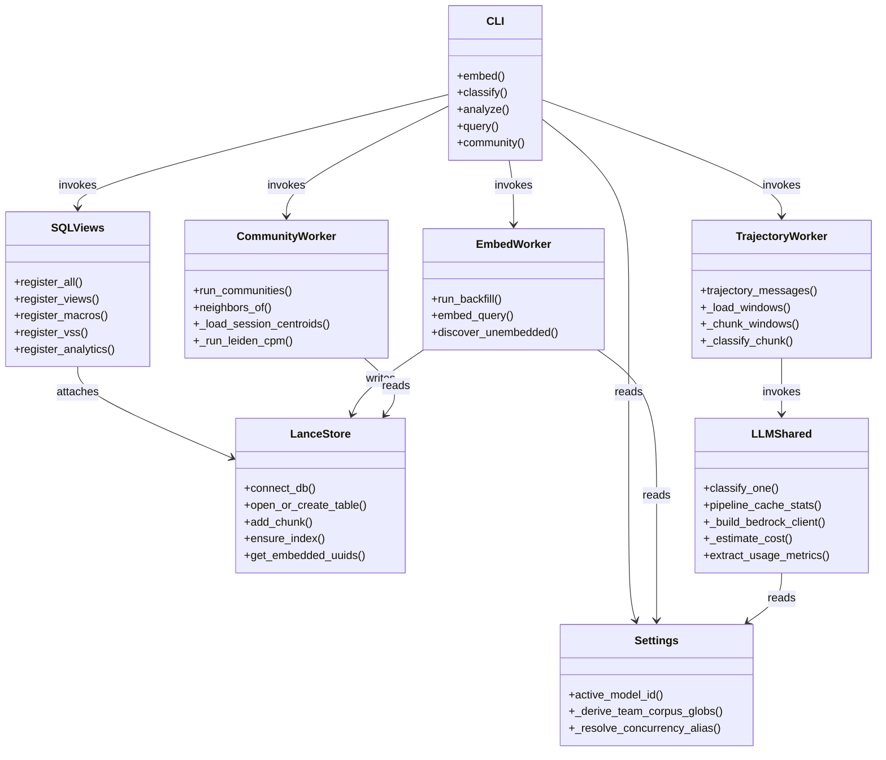

# claude-sql · Components

```mermaid
classDiagram
    class CLI {
        +embed()
        +classify()
        +analyze()
        +query()
        +community()
    }
    class Settings {
        +active_model_id()
        +_derive_team_corpus_globs()
        +_resolve_concurrency_alias()
    }
    class SQLViews {
        +register_all()
        +register_views()
        +register_macros()
        +register_vss()
        +register_analytics()
    }
    class LanceStore {
        +connect_db()
        +open_or_create_table()
        +add_chunk()
        +ensure_index()
        +get_embedded_uuids()
    }
    class EmbedWorker {
        +run_backfill()
        +embed_query()
        +discover_unembedded()
    }
    class LLMShared {
        +classify_one()
        +pipeline_cache_stats()
        +_build_bedrock_client()
        +_estimate_cost()
        +extract_usage_metrics()
    }
    class TrajectoryWorker {
        +trajectory_messages()
        +_load_windows()
        +_chunk_windows()
        +_classify_chunk()
    }
    class CommunityWorker {
        +run_communities()
        +neighbors_of()
        +_load_session_centroids()
        +_run_leiden_cpm()
    }

    CLI --> Settings : reads
    CLI --> SQLViews : invokes
    CLI --> EmbedWorker : invokes
    CLI --> TrajectoryWorker : invokes
    CLI --> CommunityWorker : invokes
    SQLViews --> LanceStore : attaches
    EmbedWorker --> LanceStore : writes
    EmbedWorker --> Settings : reads
    TrajectoryWorker --> LLMShared : invokes
    LLMShared --> Settings : reads
    CommunityWorker --> LanceStore : reads
```
