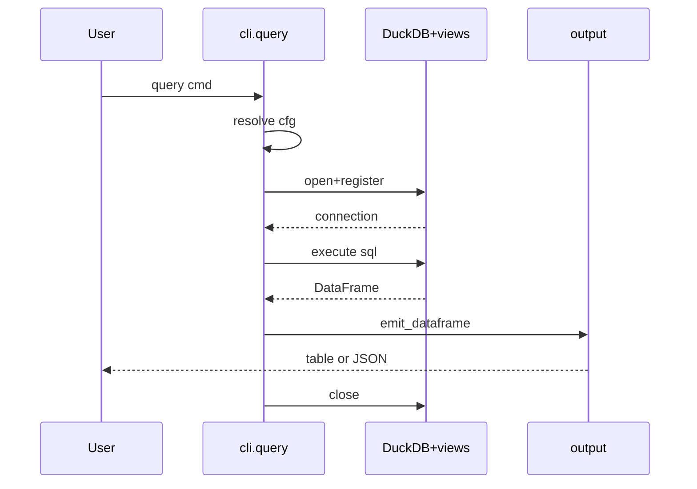
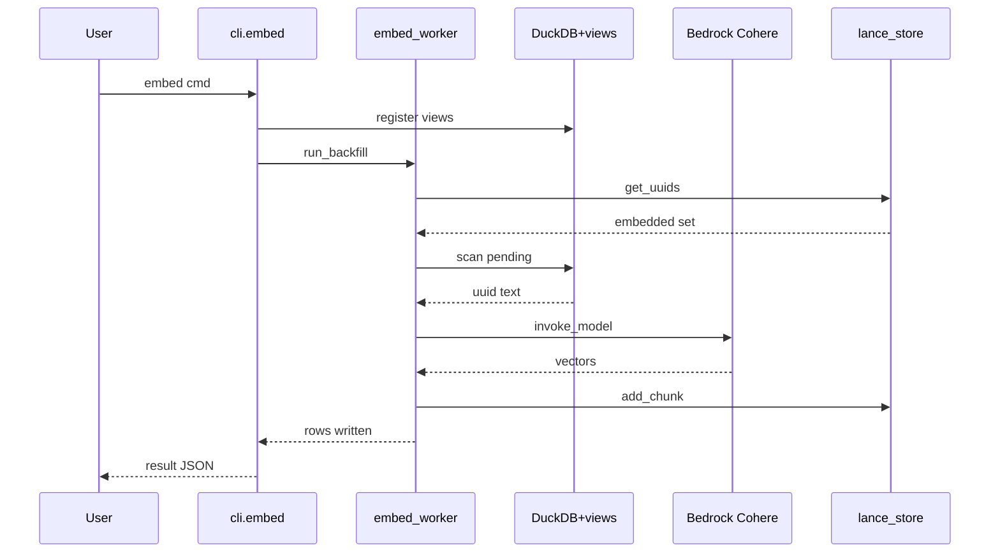
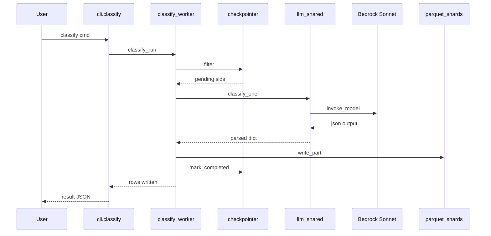

# claude-sql · Sequences

Diagram-only companion to [`behavior/processes.md`](../../behavior/processes.md)
and [`architecture/data-flow.md`](../../architecture/data-flow.md). One
`sequenceDiagram` per top process, showing the outbound call order across
participants. Every participant maps to a real module in the current
`packages/*/src/claude_sql/` layout.

## query

Read-only SQL over the DuckDB catalog — no Bedrock, no cost. Entry at
`packages/app/src/claude_sql/app/cli.py:728`; body at `cli.py:786-803`.

## embed

Embeds unembedded messages via Cohere Embed v4 on Bedrock and appends
FLOAT[1024] vectors to LanceDB. Entry at `cli.py:1559`; body at
`cli.py:1603-1628`; worker `run_backfill` at
`packages/analytics/src/claude_sql/analytics/embed_worker.py:365`;
`discover_unembedded` at `embed_worker.py:100`.

## classify

Classifies sessions with Sonnet 4.6 structured output and writes parquet
shards with session-level checkpointing. Entry at `cli.py:1730`; body at
`cli.py:1778-1793`; worker `_classify_sessions_async` at
`packages/analytics/src/claude_sql/analytics/classify_worker.py:45`;
`classify_one` at `packages/core/src/claude_sql/core/llm_shared.py:563`.

## See also

- [claude-sql · Contract map](../../insights/contract-map.md) — 5 shared source files
- [claude-sql · Processes](../../behavior/processes.md) — 5 shared source files
- [claude-sql · Data flow](../../architecture/data-flow.md) — 4 shared source files
- [claude-sql · Debugging guide](../../insights/debugging-guide.md) — 3 shared source files
- [claude-sql · Module map](../../architecture/module-map.md) — 3 shared source files
