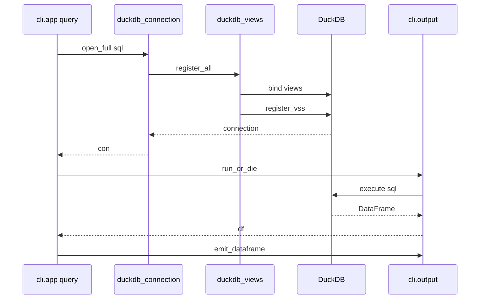
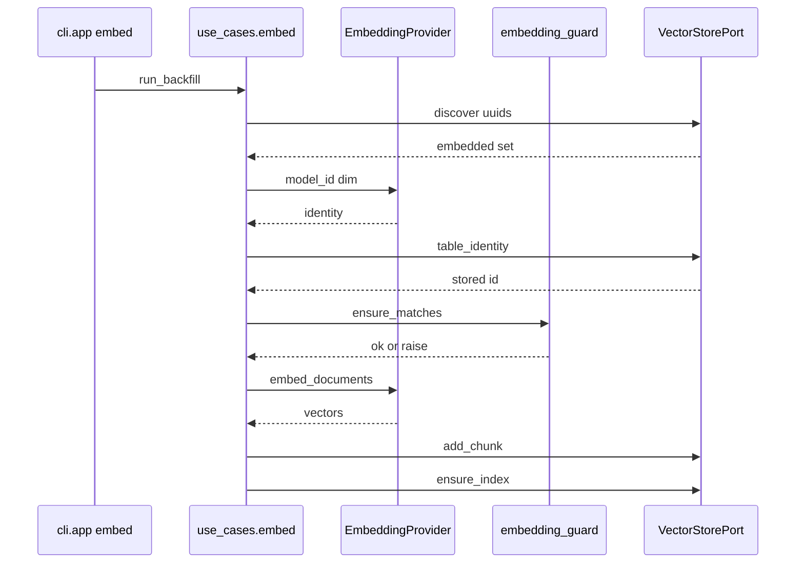
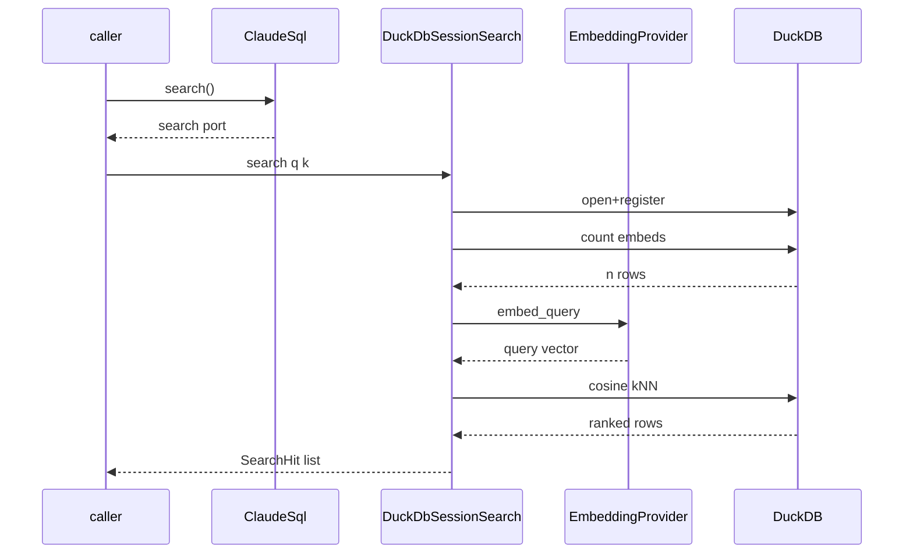

# claude-sql · Sequences

Diagram-only companion to [`behavior/processes.md`](../../behavior/processes.md)
and [`architecture/data-flow.md`](../../architecture/data-flow.md). One
`sequenceDiagram` per top process, showing the outbound call order across
participants. Every participant maps to a real module in the POST-reshape
hexagonal tree (`interfaces / application / infrastructure / domain`).

## query

Cheapest read path — one SQL statement against the DuckDB catalog, no Bedrock,
no cost. Entry at `src/claude_sql/interfaces/cli/app.py:541`; body at
`app.py:599-616`. The connection is gated by `_sql_uses_catalog`
(`app.py:604`), which routes to `open_connection_full`
(`src/claude_sql/infrastructure/duckdb_connection.py:149`) →
`register_all`/`register_vss`
(`src/claude_sql/infrastructure/duckdb_views.py:1824`). Results flow through
`run_or_die` + `emit_dataframe` (`src/claude_sql/interfaces/cli/output.py:160,61`).

## embed

Embeds unembedded messages through the active `EmbeddingProvider` port and
appends fixed-size FLOAT vectors to LanceDB, guarded by the fail-loud dimension
contract. Entry at `src/claude_sql/interfaces/cli/app.py:1307`; body at
`app.py:1356-1385`. `run_backfill`
(`src/claude_sql/application/use_cases/embed.py:222`) builds the provider once —
its `model_id`/`dimension` (`src/claude_sql/domain/ports.py:34`) are the single
dimension contract (`embed.py:304-306`) — then `ensure_store_matches`
(`src/claude_sql/domain/embedding_guard.py`) refuses a cross-provider append
before the chunk loop writes to the `VectorStorePort`
(`src/claude_sql/application/ports.py:132`, Lance impl
`src/claude_sql/infrastructure/lance_store.py:107`).

## library path (ClaudeSql facade)

The importable surface for downstream callers. The
`ClaudeSql` facade (`src/claude_sql/composition.py:36`) lazily builds and caches
the ports; `search()` (`composition.py:90`) hands back a `DuckDbSessionSearch`
(`src/claude_sql/infrastructure/session_search.py:38`). Its `search`
(`session_search.py:129`) opens + registers a connection, counts
`message_embeddings`, embeds the query via the `EmbeddingProvider` port
(`embed_query`, `session_search.py:125`), then runs the cosine-kNN join ordered
by `array_cosine_distance ASC` (`session_search.py:160-174`) to return typed
`SearchHit` rows.

## See also

- [claude-sql · Contract map](../../insights/contract-map.md) — 9 shared source citations
- [claude-sql · Impact analysis](../../insights/impact-analysis.md) — 9 shared source citations
- [claude-sql · Module map](../../architecture/module-map.md) — 5 shared source citations
- [claude-sql · Processes](../../behavior/processes.md) — 5 shared source citations
- [claude-sql · Tech debt](../../insights/tech-debt.md) — 5 shared source citations
