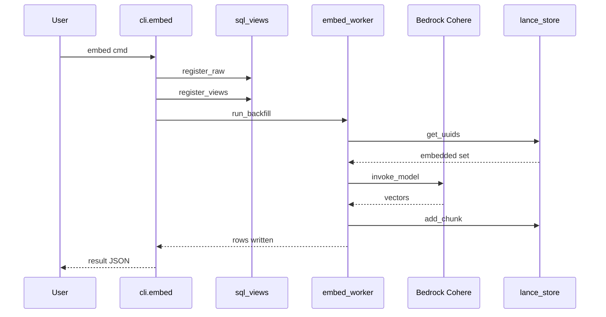
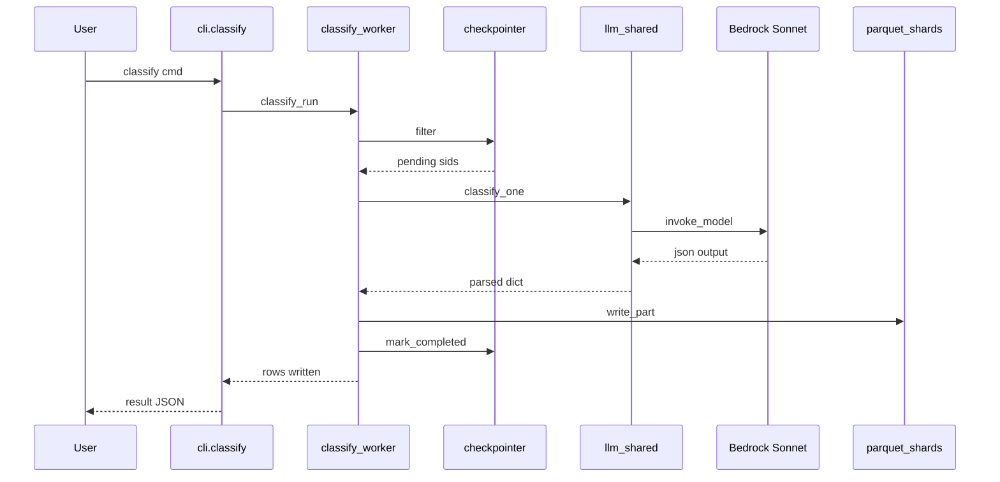
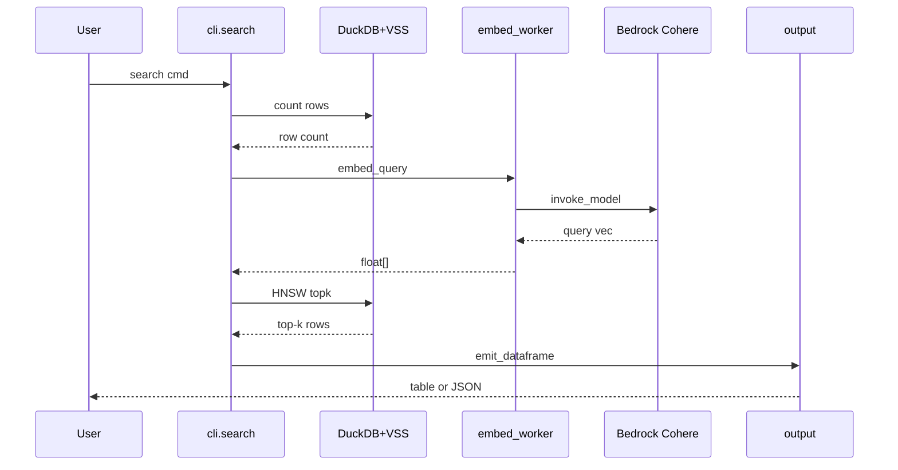

# claude-sql · Sequences

## embed

```mermaid
sequenceDiagram
    participant User
    participant CLI as cli.embed
    participant Views as sql_views
    participant Worker as embed_worker
    participant Bedrock as Bedrock Cohere
    participant Lance as lance_store

    User->>CLI: embed cmd
    CLI->>Views: register_raw
    CLI->>Views: register_views
    CLI->>Worker: run_backfill
    Worker->>Lance: get_uuids
    Lance-->>Worker: embedded set
    Worker->>Bedrock: invoke_model
    Bedrock-->>Worker: vectors
    Worker->>Lance: add_chunk
    Worker-->>CLI: rows written
    CLI-->>User: result JSON
```

## classify

```mermaid
sequenceDiagram
    participant User
    participant CLI as cli.classify
    participant Worker as classify_worker
    participant Ckpt as checkpointer
    participant LLM as llm_shared
    participant Bedrock as Bedrock Sonnet
    participant Shards as parquet_shards

    User->>CLI: classify cmd
    CLI->>Worker: classify_run
    Worker->>Ckpt: filter
    Ckpt-->>Worker: pending sids
    Worker->>LLM: classify_one
    LLM->>Bedrock: invoke_model
    Bedrock-->>LLM: json output
    LLM-->>Worker: parsed dict
    Worker->>Shards: write_part
    Worker->>Ckpt: mark_completed
    Worker-->>CLI: rows written
    CLI-->>User: result JSON
```

## search

```mermaid
sequenceDiagram
    participant User
    participant CLI as cli.search
    participant DuckDB as DuckDB+VSS
    participant Worker as embed_worker
    participant Bedrock as Bedrock Cohere
    participant Out as output

    User->>CLI: search cmd
    CLI->>DuckDB: count rows
    DuckDB-->>CLI: row count
    CLI->>Worker: embed_query
    Worker->>Bedrock: invoke_model
    Bedrock-->>Worker: query vec
    Worker-->>CLI: float[]
    CLI->>DuckDB: HNSW topk
    DuckDB-->>CLI: top-k rows
    CLI->>Out: emit_dataframe
    Out-->>User: table or JSON
```
