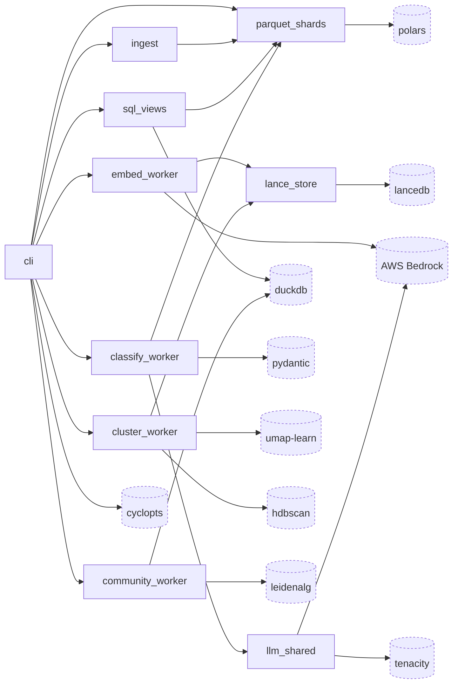

# claude-sql · Dependency graph

```mermaid
flowchart LR
    classDef external stroke-dasharray: 3 3

    cli[cli]
    ingest[ingest]
    sql_views[sql_views]
    embed_worker[embed_worker]
    classify_worker[classify_worker]
    cluster_worker[cluster_worker]
    community_worker[community_worker]
    llm_shared[llm_shared]
    lance_store[lance_store]
    parquet_shards[parquet_shards]

    duckdb[(duckdb)]:::external
    polars[(polars)]:::external
    bedrock[(AWS Bedrock)]:::external
    lancedb[(lancedb)]:::external
    cyclopts[(cyclopts)]:::external
    pydantic[(pydantic)]:::external
    umap[(umap-learn)]:::external
    hdbscan[(hdbscan)]:::external
    leidenalg[(leidenalg)]:::external
    tenacity[(tenacity)]:::external

    cli --> ingest
    cli --> sql_views
    cli --> embed_worker
    cli --> classify_worker
    cli --> cluster_worker
    cli --> community_worker
    cli --> parquet_shards
    cli --> cyclopts

    ingest --> parquet_shards
    sql_views --> parquet_shards
    sql_views --> duckdb

    embed_worker --> lance_store
    embed_worker --> bedrock
    cluster_worker --> lance_store
    cluster_worker --> umap
    cluster_worker --> hdbscan

    community_worker --> leidenalg
    community_worker --> duckdb

    classify_worker --> llm_shared
    classify_worker --> parquet_shards
    classify_worker --> pydantic

    llm_shared --> bedrock
    llm_shared --> tenacity

    lance_store --> lancedb
    parquet_shards --> polars
```
