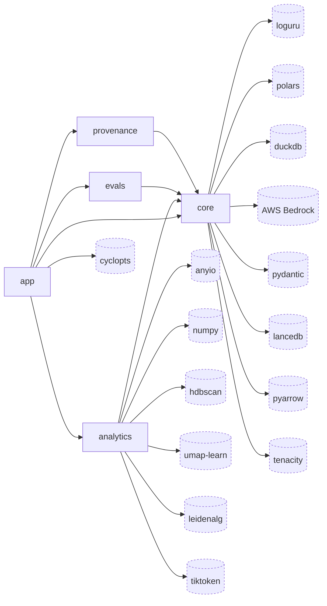

# claude-sql · Dependency graph

## Legend (overflow)

Elided external nodes (declared in `packages/*/pyproject.toml` but dropped to fit the 20-node budget), with the count of source files that import each:

| Node | Owning package | Importing files | Note |
|---|---|---|---|
| scikit-learn | analytics | 1 | `terms_worker.py:65` c-TF-IDF CountVectorizer |
| igraph | analytics | 1 (2 sites) | `community_worker.py:70` mutual-kNN graph |
| pydantic-settings | core | 1 | `config.py` settings root |
| scipy | analytics | declared only | `packages/analytics/pyproject.toml:17` |
| pyyaml | core | 1 | `config.py` YAML knobs |
| packaging | app | 1 | version parsing |
| anthropic | core | declared only | `packages/core/pyproject.toml:10`, no source import |

## See also

- [claude-sql · System overview](../../architecture/system-overview.md) — 2 shared source files
