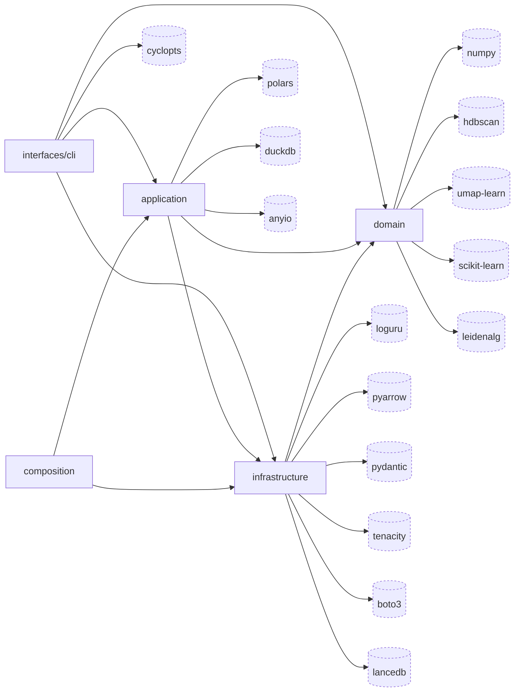

# claude-sql · Dependency graph

Internal nodes are the four hexagonal layers plus the `composition` facade, ordered by the single `import-linter` layers contract at `pyproject.toml:295-303` (`interfaces > application > infrastructure > domain`). External nodes are the direct runtime dependencies from `pyproject.toml:28-50`, ranked by how many source files import them and anchored to the layer that imports them most. Deps that fell outside the 20-node budget are in the Legend below.

## Legend (overflow)

Direct dependencies (`pyproject.toml:28-50`) elided from the diagram to hold the 20-node budget. Edge count = number of source files importing the dep.

| Dep | Anchor layer | Edges | Source |
| --- | --- | --- | --- |
| igraph | domain | 1 | `src/claude_sql/domain/structure/community.py` |
| returns | application | 1 | `src/claude_sql/application/ports.py` |
| tiktoken | domain | 1 | `src/claude_sql/domain/dedup.py` |
| pydantic-settings | infrastructure | 1 | `src/claude_sql/infrastructure/settings.py` |
| pyyaml | infrastructure | 1 | `src/claude_sql/infrastructure/skills_fs.py` |
| packaging | domain | 1 | `src/claude_sql/domain/skills.py` |
